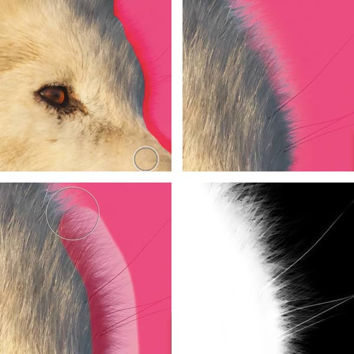

# Refining pixel selection edges

Once a selection has been created, you can refine its edges to ensure your selection is as accurate as needed.

For very fine selection, e.g. of hair against a colored background, use an adjustment brush as part of the refinement to 'brush-in' fine detail.

### Settings (or Preferences)

The following settings can be adjusted from the dialog:

- **Preview**—sets the way your selection and page display. Select from the pop-up menu.
  - **Overlay**—presents the selection overlaid against red, translucent area indicating that area as not part of the selection.
  - **Black Matte**—presents the selection against non-selected areas being blacked out.
  - **White Matte**—presents the selection against non-selected areas in white.
  - **Black & White**—presents the selection as white while non-selected areas as black.
  - **Transparent**—presents the selection against a checked pattern indicated as non-selected.
- **Matte Edges**—when selected (default), the selection area closely follows image edges. If this option is off, selection doesn't follow image edges which is useful for more accurately refining straight selection edges.
- **Border width**—expands the selection by adjusting the width of its border. Drag the slider to set the value.
- **Smooth**—determines the curvature of the selection's edge. Drag the slider to set the value.
- **Feather**—determines the softness (opacity) of the transition at the edge of the selection. Drag the slider to set the value.
- **Ramp**—In areas where there is a gradual transition from opaque to transparent pixels it makes the transition sharper and moves the selection in or out, depending on which direction you drag the slider. Fully opaque and fully transparent pixels are unaffected.
- **Adjustment brush**—determines the adjustment brush's refinement mode.
  - **Matte**—re-analyses the selection and attempts to separate foreground detail from the background. Perfect for fine detail refinements such as stray hairs or similar thin elements of a subject.
  - **Foreground**—adds to the selection (revealing more of the foreground).
  - **Background**—deletes from the selection (revealing more of the background).
  - **Feather**—softens the alpha edge of the selection.
- **Width**—sets the width of the brush tip. Type directly in the text box or drag the pop-up slider to set the value.
- **Output**—determines how the selection is applied upon exiting the dialog. Select from the pop-up menu.
  - **Selection**—applies the refinement directly to the selection.
  - **Mask**—applies the refinement to the selection as a mask.
  - **New Layer**—applies the refinement to the selection in a new layer.
  - **New Layer With Mask**—applies the refinement to the selection as a mask in a new layer.

The size of a brush (when using the Matte option) determines what is taken into consideration when Affinity Photo evaluates the apointed areas. Use a brush size that allows the app to recognize the differences between pixels and don't be afraid to paint your strokes to cover both the areas you'd like to select and those you'd like to exclude as this aids calculations.

**Selection** and **Mask** are ideal when applying adjustments and filters after refining the selection area. **New layer** and **New layer with mask** are suited to cutting out and compositing; color 'decontamination' is also used for achieving high-quality cut-out results.

*Use the **Foreground adjustment brush** to select the interior (top left, brush strokes; top right, resulting selection), then the **Matte adjustment brush** to paint along the edge and individual hairs (bottom left). Use the Preview options to inspect the refined selection (bottom right).*

### About Smooth

In Affinity Photo, smoothing the edges of your selection can be performed via the dedicated in-dialog slider.

*Smooth setting effect with a low (left) and high (right) value.*

As you increase the slider value, you’ll notice the amount of details included (left) and excluded (right) from the selection. The setting takes effect by evaluating edge pixel data and delivering a softer result as you increase the pixel value, which is great for at least a couple of scenarios: one, where you need the selected object to fade into the underlying image; or two, whereby you’d like for it to stand out with solid, more defined edges.

### About Feather

Feathering the edges of your selection can be performed by either adjusting the dedicated in-dialog slider, or setting the brush mode to **Smooth**.

*Feather setting effect with a low (left) and high (right) value.*

The **Feather** brush mode allows for the borders of your selection to be smoother, even more refined with edge pixels progressively blurred as you increase the brush size. In addition, you can modify these edges further by experimenting with the Feather slider in the dialog – the brush mode works in tandem with the slider to deliver the desired effect.

Brush size can be adjusted mid-stroke with the `[` and `]` keys.

To better visualize the effects of feathering refinements, change the Preview mode to **Black and white**.

**To refine pixel selection edges:**

1. Do one of the following:
  - From any selection tool's context toolbar, click **Refine**.
  - From the **Select** menu, select **Refine Edges**.
2. Adjust the settings in the dialog and/or select the brush mode, as required.
3. If you wish to adjust the selection edges by painting, drag on the preview.
4. Click **Apply**.

### Returning to refining pixel selections

If you selected **New layer with mask** output option the first time you refined the selection, simply right-click on the mask in the layers panel and select **Refine Mask**. If however your output was either to Selection or New Layer, and you haven’t deselected your object yet, use the same **Refine** button on the context toolbar, as before.

> **Note — Modifier keys:** The following modifier (s) can be used:
>
> - **macOS:** Press the `Ctrl` and `Alt` s together and drag on the page. Dragging left or right will decrease or increase the brush size, respectively. Alternatively, use the [ or ] s, respectively. Dragging up or down will decrease or increase the brush hardness, respectively.
> - **Windows:** Press the `Cmd` and `Alt` s together and drag on the page. Dragging left or right will decrease or increase the brush size, respectively. Alternatively, use the [ or ] s, respectively. Dragging up or down will decrease or increase the brush hardness, respectively.

#### SEE ALSO:

- [Creating pixel selections](01-creating-pixel-selections/01-overview.md)
- [Modifying pixel selections](02-modifying-pixel-selections.md)
