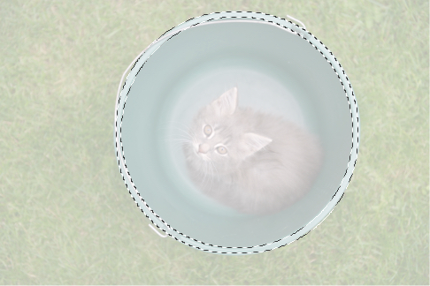

# Creating outline selections

The Outline feature allows you to create a new selection based on the outer edges of a previously created selection.

*Before and after outline selection created.*

### Settings (or Preferences)

The following settings can be adjusted from the relevant dialogs:

- **Radius**—controls the width of the selection.
- **Circular**—when enabled, the selection edges become increasingly rounded with growing Radius values.
- **Alignment**—determines to origin for the expansion. Select from the pop-up menu.

**To create an outline selection:**

1. With a selection in place, from the **Select Menu**, select **Outline**.
2. Adjust the settings in the dialog.
3. Click **Apply**.

#### SEE ALSO:

- [Creating pixel selections](01-creating-pixel-selections/01-overview.md)
