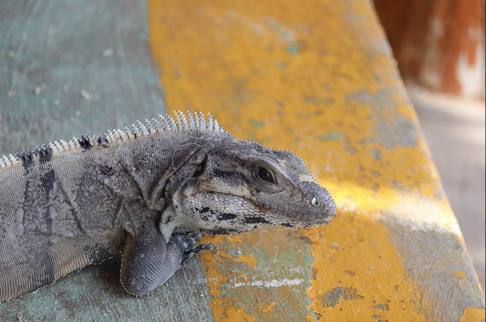
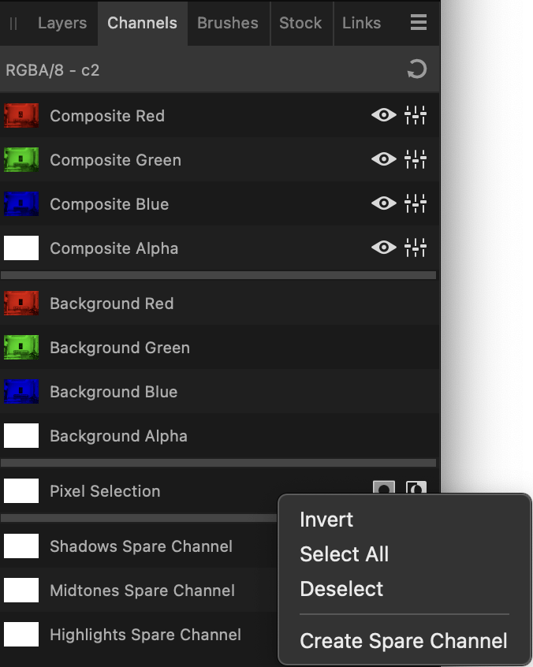

# Saving and loading selections

You can save pixel selections for later use in the current project or future projects. It's useful to be able to reinstate more complex selections at any time and stage of your project.

*Subject pixel selection.*

## Saving selections as alpha channels

Any number of selections can be stored as spare alpha channels in the **Channels** panel for future use. From there you can reinstate any selection on demand. To learn more visit [Pixel selections from channels](01-creating-pixel-selections/07-from-channels.md).

*Channels panel showing stored selections (each named as Spare Channel) for future use.*

## Saving selections to file

Instead of using the Channels panel, selections can be saved to a standalone file. Saved selections can then be loaded from the file into the same or another project.

**To save a selection as an alpha channel:**

- With a pixel selection in place, `Click`-click the 'Pixel Selection' entry and select **Create Spare Channel**.

The selection is stored at the bottom of the Channels panel as a new 'Spare Channel' entry.

**To reinstate a saved selection:**

On the **Channels** panel, `Click`-click the 'Spare Channel' entry, which lets you:

- Load to Pixel Selection—the saved selection is added as a new selection on the page.
- Add/Subtract/Intersect to Pixel Selection—the saved selection is added to, subtracted from, or intersected with an existing selection on the page.
- Load to "Layer name"—the saved selection is added to the mask, adjustment, or live filter layer if previously selected in the Layers panel.
- Load to "Layer name" channel—loads the selection to a channel (e.g., Red) if the channel's layer was previously selected in the **Layers** panel.

The selection is stored at the bottom of the Channels panel as a new 'Spare Channel' entry.

**To save a selection to a file:**

1. With a pixel selection in place, from the **Select** menu, select **Save Selection**.
2. Adjust the dialog settings as required.
3. Click **Save**.

**To load a selection from a file:**

1. From the **Select** menu, select **Load Selection from File**.
2. Select the **.afselection** file you want and click **Open**.

#### SEE ALSO:

- [Creating pixel selections](01-creating-pixel-selections/01-overview.md)
- [Pixel selections from channels](01-creating-pixel-selections/07-from-channels.md)
- [Using channels](../13-channels/01-using-channels.md)
