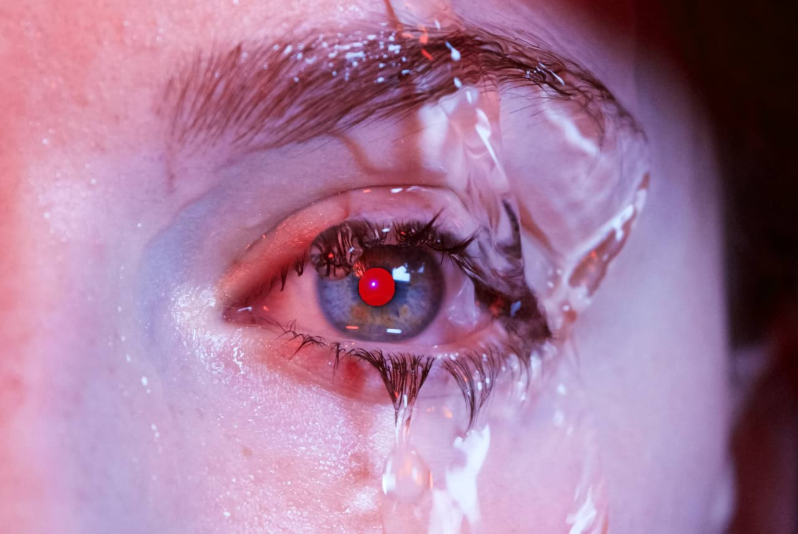
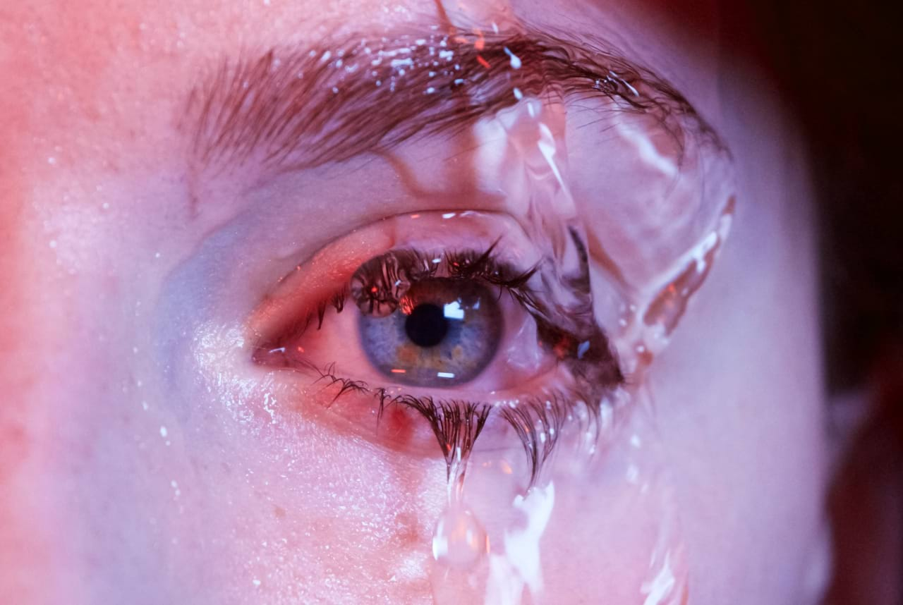

# Removing Red Eye

Red eye is an unsightly effect caused by a camera's flash in low light conditions. However, it can be easily corrected using the **Red Eye Removal Tool**.

The **Red Eye Removal Tool** detects red coloration in a subject's pupil and instantly removes it.

**To fix red eye:**

1. Use the **Layers** panel to select the layer containing a subject with the red eye effect.
2. Click the **Red Eye Removal Tool**.
3. Place the pointer above and slightly to the left of the pupil.
4. Drag the bounding box so that it covers the pupil and release. The pupil should change color. If the initial selection is wrong, [undo](../30-design-aids/03-using-undo-redo-and-history.md) the result and reselect the bounding box.
5. The effect of the tool is cumulative. If the result is not dark enough, repeat the selection.

> **Tip:** Avoid making the rectangle too large as you may affect other red-based areas of the image.

#### SEE ALSO:

- [Red Eye Removal Tool](../32-tools/07-retouch-tools/14-red-eye-removal-tool.md)
