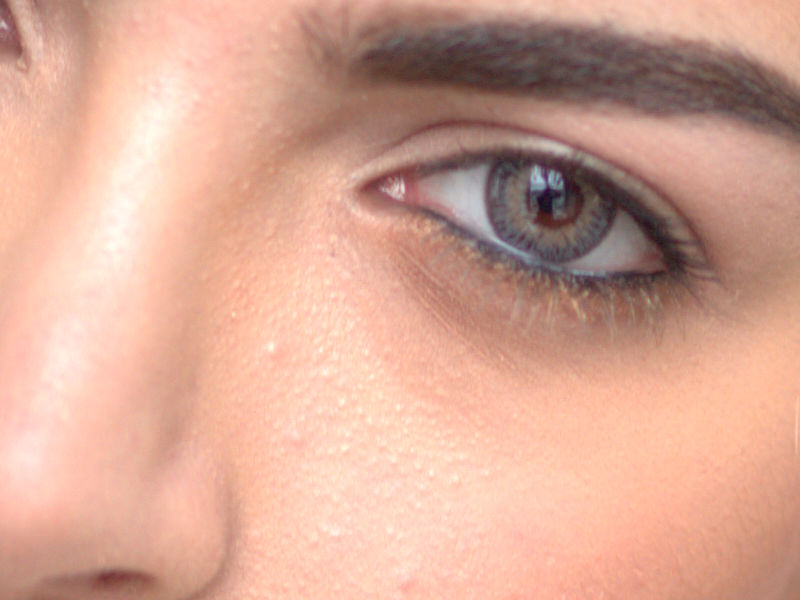

# Removing blemishes

Use the **Blemish Removal Tool** to remove small imperfections such as pimples, with a single click.

The Blemish Removal Tool works by blending a target area with a sample area to remove (or reduce) the undesired discoloration.

*Before and after cloning to fix skin imperfections.*

**To remove blemishes:**

1. Use the **Layers** panel to select a layer to work on.
2. Click **Blemish Removal Tool** from the **Tools** panel.
3. Adjust the context toolbar settings.
4. Do one of the following:
  - Click on the target area.
  - Drag from the target area to the sample area.

> **Note — Modifier keys:** The following modifier (s) can be used:
>
> - To change brush size, use the [ or ] .

#### SEE ALSO:

- [Blemish Removal Tool](../32-tools/07-retouch-tools/12-blemish-removal-tool.md)
- [Cloning and healing](04-cloning-and-healing.md)
- [Patching](06-patching.md)
