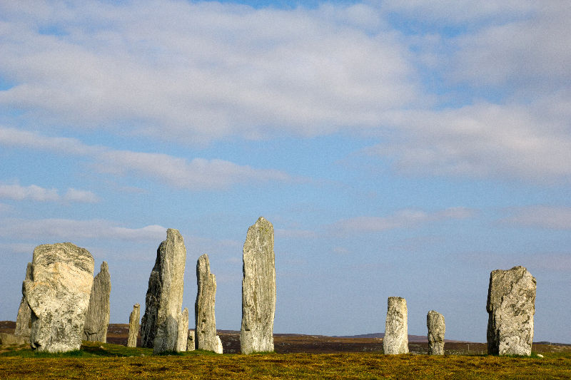
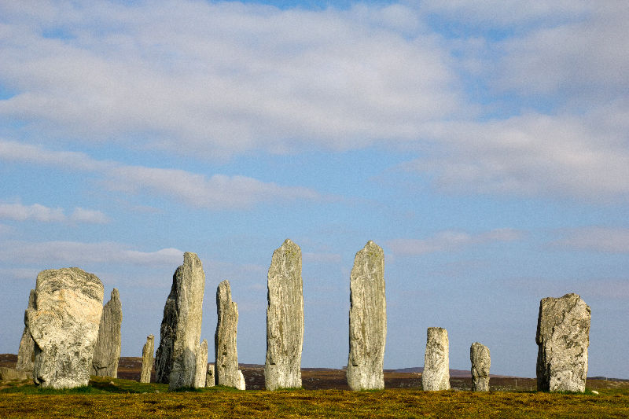
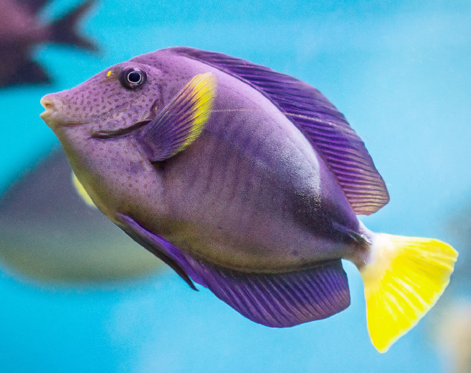

# Cloning and healing

Cloning is the process of duplicating samples from one part of an image to introduce replicated content for creative effect or to repair the original.

## About cloning

### The clone source

The [Clone Brush Tool](../32-tools/07-retouch-tools/04-clone-brush-tool.md) copies pixels from one part of an image (or layer) to another. The tool uses a source (shown as a '+' cursor) to clone from; this moves in relation to the tool's cursor (shown as an 'o' cursor) with its position being able to be redefined as you clone from different areas.

*Before and after cloning. Introducing a cloned object to your image.*

The clone source can be one of the following context toolbar options:

- **Current Layer**—pixels on the selected layer only.
- **Current Layer & Below**—pixels on the currently selected layer and any visible layers beneath (including vector objects and the effects produced by adjustment layers).
- **Layers Beneath**—pixels on any visible layer beneath the currently selected layer (including those from any vector objects and the effects produced by any visible adjustment layers).
- **Global**—pixels previously sampled by cloning in from one or more other documents (pixel layer only).

### Global source

You can define a global *source* in a secondary open document and paint the sampled pixels into your working document by selecting the clone source option 'Global'. The **Sources** panel stores all your global sources; you can then select any stored global source and clone from it. Any new documents can make use of the panel's global sources.

> **Note:** The Global source can only be defined from a single, pixel layer. To use a document containing multiple layers and/or vector objects, you must flatten the document first.

## About healing

The Healing Brush Tool paints samples from one part of an image onto another. It's useful for removing defects and for general photo retouching. In many respects it works like the cloning, however, it blends the target pixels with the sample pixels by matching the texture, tone, and transparency of the sample pixels with the target pixels.

*Before and after healing of an unwanted line crossing an image.*

**To clone/heal a sample from the current image:**

1. Use the **Layers** panel to either select an existing pixel layer to copy to, or to create a new pixel layer.
2. Select the **Clone Brush Tool** or **Healing Brush Tool** from the **Tools** panel.
3. The tool uses a soft-round brush by default. To use a different brush style, choose one from the **Brushes** panel.
4. Adjust the context toolbar settings.
5. To define (or re-define) the cloning source, hold the `Alt`  and click on the area you wish to begin sampling from.
6. (Optional) Rotate the sample by either using the left and right arrow keys or the **Rotation** control on the context toolbar.
7. (Optional) Set the scale of the sample by either using the up and down arrow keys or the **Scale** control on the context toolbar.
8. (Optional) Transform the sample by using the **Flip** pop-up menu on the context toolbar.
9. Drag on the image to paint the sample.

> **Tip:** It is best practice to temporarily hide adjustment layers during the above procedure. This allows you to copy the original image. If the adjustment layers are visible, the *adjusted* pixels will be permanently applied.

> **Note — Modifier keys:** The following modifier (s) can be used:
>
> - To change brush size, use the [ or ] .

**To clone/heal a sample from one image to another:**

1. Open the image that you want to copy pixels from and use the **Layers** panel to select the pixel layer that you wish to copy from. Use your keyboard's left or right arrow keys to manually rotate your brush nozzle(s) before and during stroke application.
2. Click the **Clone Brush Tool** or **Healing Brush Tool**.
3. To define (or re-define) the cloning source, hold the `Alt`  and click on the area you wish to begin sampling from.
4. On the context toolbar, click **Add Global Source**.

The source is stored, along with other global sources, in the **Sources** panel. The panel can be switched on via the **Window** menu.

1. Open the image that you want to paint the sample into.
2. Use the **Layers** panel to either select an existing pixel layer to copy to, or to create a new pixel layer.
3. Click the **Clone Brush Tool** or **Healing Brush Tool**.
4. The tool uses a soft-round brush by default. To use a different brush style, choose one from the **Brushes** panel.
5. Adjust the context toolbar settings.
6. Select a stored global source from the **Sources** panel. If you only have one global source you can simply select the **Global** source from the pop-up menu on the context toolbar instead of using the panel.
7. (Optional) Select rotate, scale or flip options as described above.
8. Drag on the image to paint the sample.

#### SEE ALSO:

- [Clone Brush Tool](../32-tools/07-retouch-tools/04-clone-brush-tool.md)
- [Healing Brush Tool](../32-tools/07-retouch-tools/10-healing-brush-tool.md)
- [Removing Blemishes](03-removing-blemishes.md)
- [Patching](06-patching.md)
- [Sources panel](../33-panels/24-sources-panel.md)
