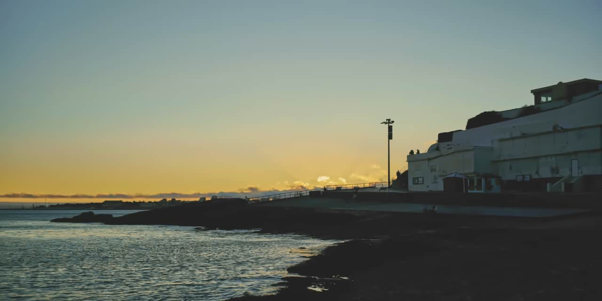
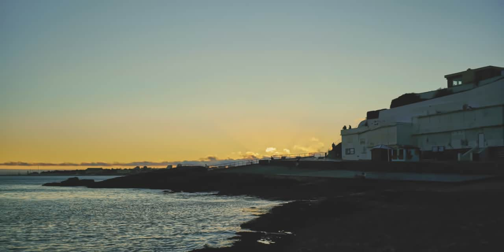

# Inpainting

Inpainting (image interpolation) is the process by which lost or deteriorated image data is reconstructed, but within the context of digital photography can also refer to replacing or removing unwanted areas of an image.

*Removing objects from a landscape image.*

## About inpainting

The [Inpainting Brush Tool](../32-tools/07-retouch-tools/13-inpainting-brush-tool.md) is used to paint over (and identify) damaged or unwanted areas. Complex algorithms then take over to harvest information from the surrounding areas of the image in order to reconstruct the missing data.

For example, you can remove or replace:

- Power lines and other obstructions
- People and animals
- Vignetting
- Lens flares
- Background details
- Dust spots and scratches
- Stuck or "hot" pixels

> **Note:** Inpainting is particularly useful for repairing physically damaged printed photos which have been subsequently digitized.

Upon the inpainting process, the selected RAW or image layer is rasterized. This behavior can be modified via the app's **Settings** in the **Assistant** options section.

**To restore image data using the Inpainting Brush Tool:**

1. Use the **Layers** panel to select a layer to work on.
2. Click the **Inpainting Brush Tool**.
3. The tool uses a soft-round brush by default. To use a different brush style, choose one from the **Brush** panel.
4. Adjust the context toolbar settings.
5. Drag across the image to identify the area of lost or damaged data.

### Best Practices:

- Zoom in close to the area you wish to inpaint.
- Set a suitable brush size from the context toolbar.
- If you are painting out people or complex shapes, try painting over gaps (e.g., inbetween legs and arms) as well for better consistency.
- Remember you can always do multiple passes if the result of the inpainting does not look authentic or seamless enough. Simply paint over the areas again.

> **Note — Modifier keys:** The following modifier (s) can be used:
>
> - To change brush size, use the [ or ] .

> **Note:** As a supplementary method to brush-based inpainting, you can inpaint areas selected in advance via **Edit>Inpaint**.

#### SEE ALSO:

- [Inpainting Brush Tool](../32-tools/07-retouch-tools/13-inpainting-brush-tool.md)
- [Cloning and healing](04-cloning-and-healing.md)
- [Settings](../37-settings-preferences/01-settings-preferences.md)
