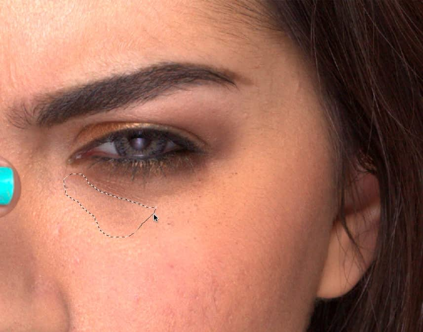
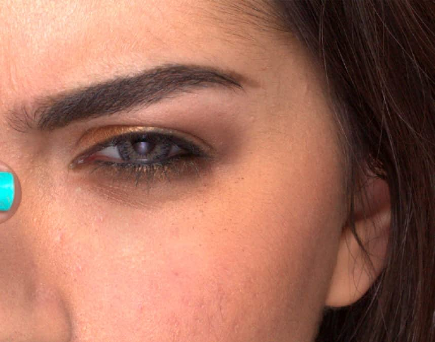

# Patching

Patching is a retouching technique which involves replacing an undesirable pixel region with a patch (a drawn freehand selection area) made up of pixels sourced from another, more suitable, part of your image or another document.

*Patching out an extensive mascara smudge enclosed within the patch's freehand selection area.*

## About patching

Patching, like [healing](04-cloning-and-healing.md#healing), blends the target pixels with the sample pixels by matching the texture, tone, and transparency of the sample pixels with the target pixels. For effective results, colors in the source and target areas should vary slowly to help create a seamless boundary that blends into the target's surroundings.

Take care to avoid including in your source sharp edges where color changes dramatically, which can introduce unwanted color tinges at the target.

When patching, the context toolbar offers options to apply only the texture of the source to the target, and to apply a level of transparency so the target and source pixels are blended together.

### Selection

The selection can act as any of the following:

- **As Target**—pixels are modified based on the properties of the source pixels. These pixels are sourced from under the cursor anywhere outside the selected area.
- **As Source**—pixels are used to modify the target area(s) selected.  
For both, the sample can be scaled or rotated before or after it has been applied.

### Global source

You can define a source in one open document and paint the sampled pixels into another open document using **Set Global Source**.

Once a source is defined, the **Global source** option becomes available from the layer selection pop-up menu. It will remain available until a new source is defined, even if the original global source document is closed.

> **Note:** The Global source can only be defined from a single, pixel layer. To use a document containing multiple layers and/or vector objects, you must flatten the document first.

**To patch when selection is target:**

1. Use the **Layers** panel to either select an existing pixel layer to copy to, or to create a new pixel layer.
2. Select the **Patch Tool** from the **Tools** panel.
3. Drag on the image to draw a freehand selection area. This will be the *target* area.
4. Adjust the context toolbar settings. Repeat the above step if necessary.
5. Click on the image to define the source area.
6. (Optional) Drag the nodes of the applied area to modify the scale and rotation. Alternatively, use the **Scale** and **Rotation** controls on the context toolbar, or use the up and down arrow keys to control scale and the left and right arrow keys to control rotation.
7. Click anywhere on the image to confirm placement and remove the selection.

> **Tip:** It is generally best practice to temporarily hide adjustment layers during the above procedure. This allows you to copy the original image. If the adjustment layers are visible, the *adjusted* pixels will be permanently applied.

**To patch when selection is source:**

1. Use the **Layers** panel to either select an existing pixel layer to copy to, or to create a new pixel layer.
2. Click the **Patch Tool**.
3. On the context toolbar, select **Selection is source**.
4. Drag on the image to define a selection. This will be the *source* area.
5. Adjust the context toolbar settings. Repeat the above step if necessary.
6. Click on the image to place pixels from the source area.
7. (Optional) Drag the nodes of the applied area to modify the scale and rotation. Alternatively, use the **Scale** and **Rotation** controls on the context toolbar, or use the up and down arrow keys to control scale and the left and right arrow keys to control rotation.

> **Note:** You can patch repeatedly with the same source by clicking on different areas of your image.

**To patch from a global source:**

1. Open the image that you want to copy pixels from and use the **Layers** panel to select the pixel layer that you wish to copy from.
2. Click the **Patch Tool**.
3. On the context toolbar, select **Selection is source**.
4. Drag on the image to define a selection. This will be the *global source* area.
5. On the context toolbar, click **Set Global Source**.
6. Open the image that you want to paint the sample into.
7. Use the **Layers** panel to either select an existing pixel layer to copy to, or to create a new pixel layer.
8. Click the **Patch Tool**.
9. On the context toolbar:
  - Ensure **Selection is source** is still selected.
  - Select **Global** from the layer selection setting.
10. Click on the image to place pixels from the source area.
11. (Optional) Drag the nodes of the applied area to modify the scale and rotation. Alternatively, use the **Scale** and **Rotation** controls on the context toolbar, or use the up and down arrow keys to control scale and the left and right arrow keys to control rotation.

#### SEE ALSO:

- [Patch Tool](../32-tools/07-retouch-tools/11-patch-tool.md)
- [Cloning and Healing](04-cloning-and-healing.md)
- [Removing Blemishes](03-removing-blemishes.md)
