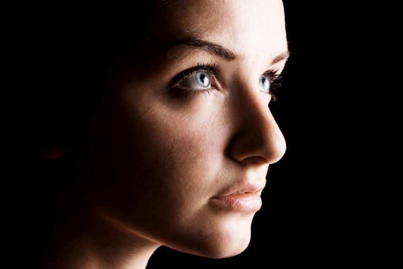

# Frequency separation

Frequency separation allows you to retouch texture and tone/color independently for powerful portrait retouching.

*Before and after retouch on high and low frequency layers.*

## Frequency separation

Although the term frequency separation is initially intimidating, the concept is straightforward. By automatically separating your image color/tone and texture into separate low and high frequency layers, respectively, you'll be able to retouch color/tone and texture independently.

- *Skin tone and color* (shadows, blotches, etc.) are made smoother by blurring with the Dodge or Blur Brush Tool. The Healing Brush Tool also works well here.
- *Unwanted textures* (spots, stray hair, blemishes, dimples, and wrinkles) can be removed with the Clone Brush Tool or Blemish Removal Tool.

> **Note:** In frequency separation, a blur filter and High Pass filter (Linear Light blend mode) are applied to created low and high frequency layers, respectively.

**To apply frequency separation:**

1. From the **Filters** menu, select **Frequency Separation**.
2. Drag on either high or low pass preview panes, to set the **Radius** (or use the slider in the dialog); this sets the balance between texture and tone. Set the value so the image's Low Frequency preview blends image color and tone but without losing major features within it.
3. (Optional) From the dialog, choose a **Method** to blur the low frequency layer:
  - Gaussian (Default): this offers a smooth blur using a weighted average.
  - Median: this blurs by broadening color regions; it retains edges better than Gaussian blur.
  - Bilateral: this blurs while retaining areas of high contrast at image edges. Use the **Tolerance** slider with this blur to control how much major features are preserved when applying subsequent brush strokes.

> **Tip:** Use selection tools and masking on both frequency layers just as with other layers.

> **Tip:** Press the **F** key to switch from the High frequency layer to the Low frequency layer (and vice versa).

**To retouch color or tone:**

1. From the **Layers** panel, select the Low Frequency layer.
2. Apply retouch tools to the layer as appropriate.

**To retouch textures:**

1. From the **Layers** panel, select the High Frequency layer.
2. Apply retouch tools to the layer as appropriate.

#### SEE ALSO:

- [Retouching](02-retouching.md)
