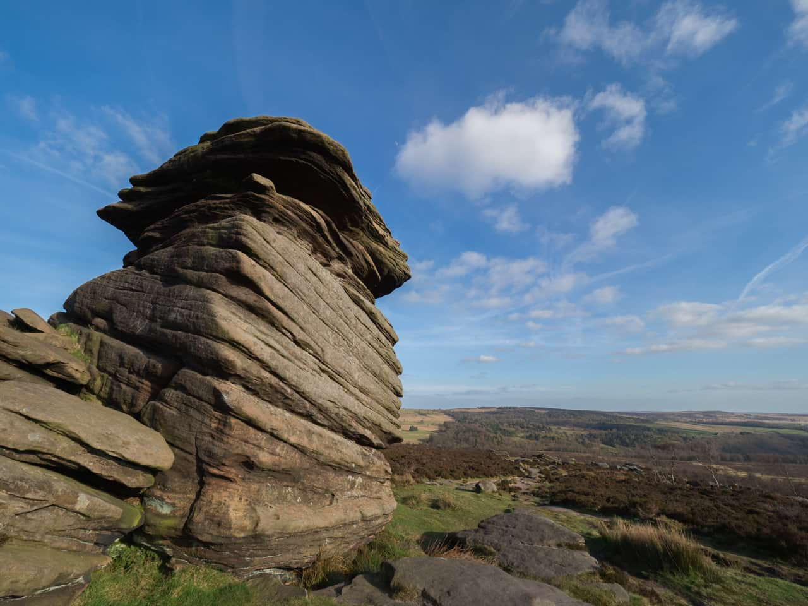
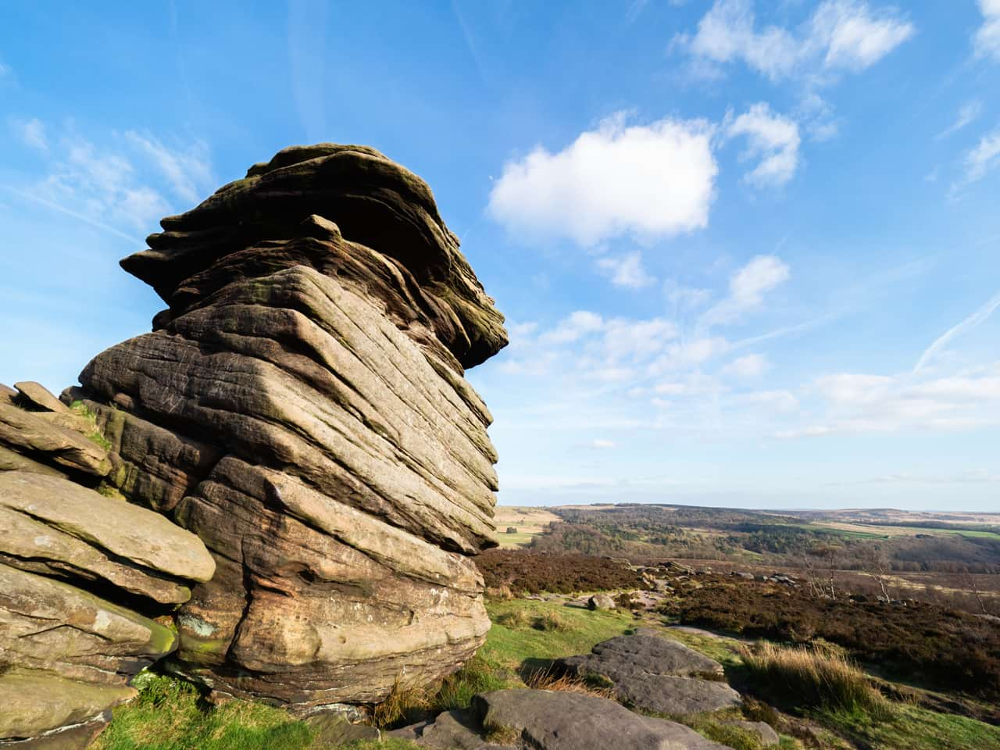

# Brightness / Contrast adjustment

Adjust the values in the shadows and highlights, and the overall tonal range, of images.

*Before and after adjustment applied.*

> **Note:** You can also adjust the tonal range of images using the **Levels** and **Curves** adjustments.

### Settings

The following settings can be adjusted:

- **Brightness**—controls the lightness/darkness of the image. Drag the slider to the left to decrease brightness, drag to the right to increase it.
- **Contrast**—controls the tonal range of the image. Drag the slider to the left to decrease the contrast between dark and light areas, drag to the right to increase it.
- **Linear**—by default, the adjustment prevents shadow and highlight clipping by modifying pixels relative to their original lightness value. When selected, this option modifies pixels using absolute values and clipping may occur.

#### SEE ALSO:

- [Applying adjustments](../01-applying-adjustments.md)
- [Levels adjustment](04-adjustment-levels.md)
- [Curves adjustment](02-adjustment-curves.md)
- [Shadows/Highlights adjustment](05-adjustment-shadowshighlights.md)
