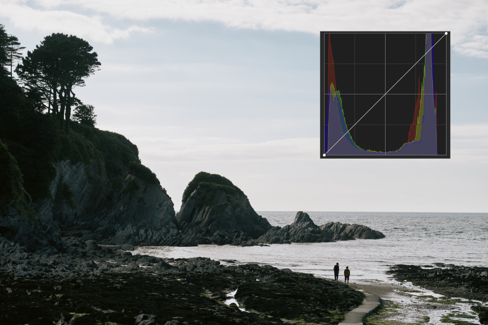
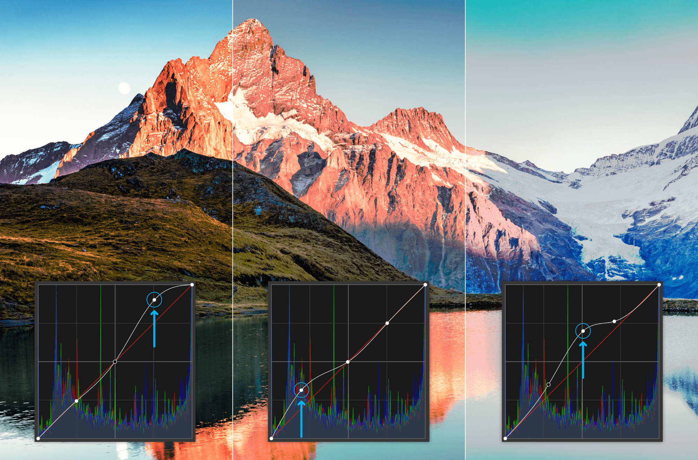

# Curves adjustment

Adjust the color, tone and alpha channels with the curves adjustment, either on individual channels or by adjusting the master curve.

Curve reset

Inverted S Curve

S Curve

In the images above, the effects of a default reset curve, an inverted "S" curve and an "S" curve are presented. As shown, the inverted "S" curve type can be used to reveal more detail in the shadows while protecting the highlights. The "S" curve, on the other hand, is typically used to obtain better control over image contrast while delivering deeper shadows and brighter highlights.

You can use the Curves adjustment to manipulate individual color channels. The adjustment can be used on placed images as well.

> **Note:** This adjustment is available in [Develop Persona](../../04-develop-persona-raw/01-developing-raw-images.md) on the **Tones** panel.

> **Tip:** Adjustments can be made in any color mode, regardless of the document's current color mode (so you can edit LAB curves in an RGB document and vice versa).

### Settings

The following settings can be adjusted in the dialog:

- **Add Preset**—allows you to save the Curve adjustment for later use.
- **Merge**—merges the Curve adjustment layer with the ones below it.
- **Delete**—deletes the Curves adjustment and its layer from the panel.
- **Reset**—reverts the spline graph to its default position.
- Select a color mode (**GREY/RGB/CMYK/LAB**) from the pop-up menu.
- Specify a single color channel to apply the adjustment to, including the layer's alpha channel. **Master** (default) applies the adjustment to all color channels, excluding the alpha channel.
- **Picker**—click to activate the picker which allows you to drag on the image to modify the adjustment. Regardless of the color model set, a click-drag places a node on the curve in relation to the selected pixel intensity; a 1x1 pixel area is considered. Secondly, dragging up (to lighten the image) or dragging down (to darken it) modifies the adjustment. The curve graph will update accordingly.
- **X**—accurately positions any added and currently selected node on the X-axis of the graph. Use for precision in 32-bit linear workflows.
- **Y**—accurately positions any added and currently selected node on the Y-axis of the graph. Use for precision in 32-bit linear workflows.
- **Min** and **Max** are the input minimums and input maximums and let you determine the range/threshold of values that are affected by the adjustment. They use a normalized 0-1 range (regardless of bit depth) but setting **Max** to >1 allows for the adjustment to manipulate HDR values as well. They can be also be used to fine-tune the manipulated tonal range in 8-bit and 16-bit documents.
- **Opacity**—sets the level of visibility of the Curves adjustment.
- **Blend Mode**—controls how the Curves adjustment interacts with the layers below it.

> **Note:** The color mode, **Alpha** channel and **Picker** options are not available in Develop Persona.

### About curves

Curves can be used as a powerful alternative to controlling the brightness and contrast of your images. Depending on the position of nodes on the curve, various luminance levels can be achieved. The Curves graph is divided into three distinct areas responsible for:

- the shadows (dark tones) on the left.
- the midtones in the center.
- the highlights on the right-hand side.

When the curve is lifted up, the area of the image affected will increase in its luminance value making those regions brighter. When pulled down, the luminance value will decrease thus making those areas darker.

*From left: Curves adjustments affecting highlights, shadows, and midtones, respectively.*

**To adjust a curves graph:**

On the curves graph, do any of the following:

- In the dialog, click **Picker** and then drag up or down on the page.
- Drag the curve to adjust the tonal range of the image.
- Click on the curve to add additional nodes.
- Click to select a node and then press the `Backspace`  to remove it.

> **Tip:** In general:
>
> - Drag the curve downwards to correct overexposure.
> - Drag the curve upwards to correct underexposure.
> - Create a gentle S-shape by adding nodes (see above) and dragging the curve in opposite directions to correct washed out images and to better control contrast.

> **Tip:** To fine-tune node positions, try nudging a selected node by pressing the left, right, up, or down arrow key (or alter **X** and **Y** values).

#### SEE ALSO:

- [Applying adjustments](../01-applying-adjustments.md)
- [Levels adjustment](04-adjustment-levels.md)
- [Brightness and Contrast adjustment](01-adjustment-brightnesscontrast.md)
- [Shadows/Highlights adjustment](05-adjustment-shadowshighlights.md)
- [Using channels](../../13-channels/01-using-channels.md)
