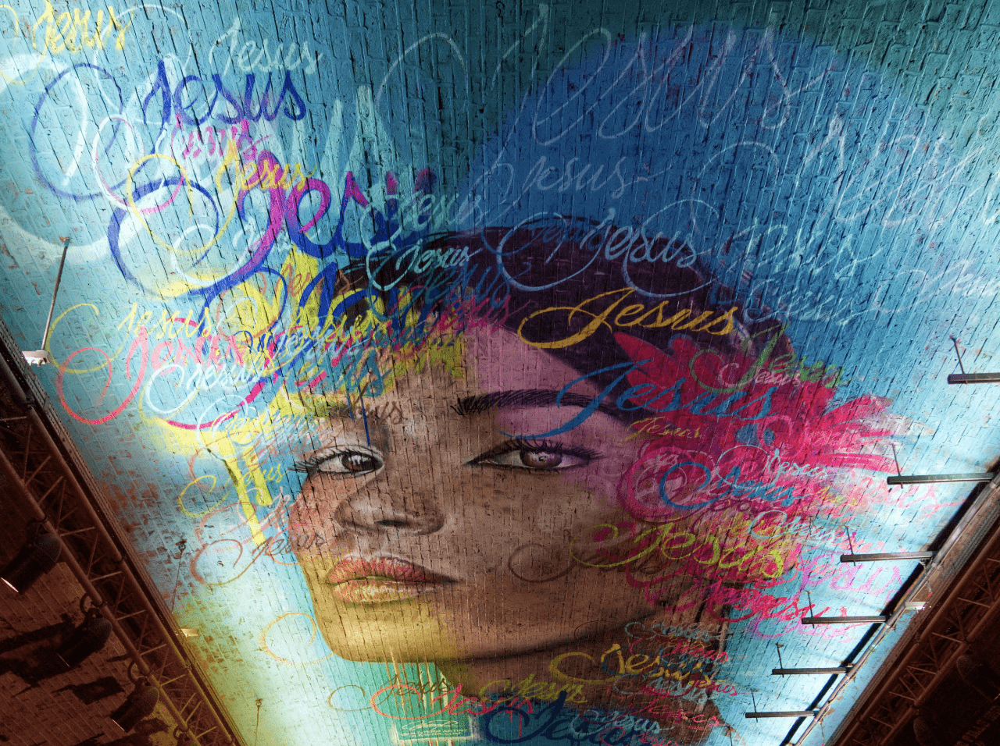
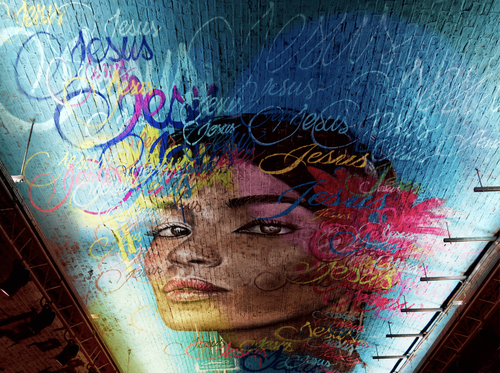

# Levels adjustment

Adjust the tonal values and color balance of an image by setting the black point, white point, and gamma. Adjusting the levels affects the pixel distribution within an image.

*Before and after adjustment applied.*

### About levels and color information

Apart from manipulating tonality globally (Master option), levels can also be used for adjusting individual color channels. The following color models are available from the dialog (with the subsequent options listed):

- **RGB**—the default color space pre-defined by document setup and commonly used for digital projects. Choose from Red, Green, Blue or Alpha for targeted channel editing.
- **Grey**—for manipulating levels in grayscale. Choose from Master, Intensity or Alpha.
- **CMYK**—commonly used in mixing and preparation of projects primarily for printing. Choose from Master, Cyan, Magenta, Yellow, Black or Alpha.
- **LAB**—a three-axis color space that includes colors outside of human acuity. Choose from Master, Lightness, AOpponent, BOpponent or Alpha.

See [Color models](../../12-color/02-color-models.md) for more information.

> **Tip:** Adjustments can be made in any color mode, regardless of the document's current color mode.

### Settings

The following settings can be adjusted:

- Select a color mode from the first pop-up menu.
- Specify a single color channel to apply the adjustment to, including the layer's alpha channel. **Master** (the default choice) applies the adjustment to all color channels*, excluding alpha channel*.
- **Black Level**—determines the range of pixels in the image considered to be pure black. Drag the slider to the right to include pixels in the range (thereby increasing shadows), drag to the left to exclude pixels (thereby reducing shadows).
- **White Level**—determines the range of pixels in the image considered to be pure white. Drag the slider to the left to include pixels in the range (thereby increasing highlights), drag to the right to exclude pixels (thereby reducing highlights).
- **Gamma**—determines the distribution of mid-tone pixels in the image. Enter a gamma value or drag the slider to the left to redistribute pixels towards the black point, drag to the right to redistribute towards the white point.
- **Output Black Level**—remaps the output level of absolute black. Moving the slider to the right makes the image look more pale and washed out.
- **Output White Level**—remaps the output level of absolute white. Moving the slider to the left lessens the intensity of highlights in the image.
- **Opacity**—controls how see-through the adjustment is.
- **Blend Mode**—controls how the Levels adjustment interacts with the layers below it.

The following options are also found on the dialog:

- **Add Preset**—adds the current adjustment settings as a preset for use with later images and projects.
- **Merge**—applies modifications set by parameters and settings to layers below and exits Levels adjustment.
- **Delete**—deletes the Levels adjustment and its layer from the panel.
- **Reset**—reverts all adjustment settings to default.

> **Tip:** To create a negative-style (inverted) image, position the **Black Level** slider further to the right than the **White Level**.

> **Note:** Holding the `Alt`  while modifying the Black Level or White Level provides a realtime clipping preview.

#### SEE ALSO:

- [Applying adjustments](../01-applying-adjustments.md)
- [Curves adjustment](02-adjustment-curves.md)
- [Brightness and Contrast adjustment](01-adjustment-brightnesscontrast.md)
- [Shadows/Highlights adjustment](05-adjustment-shadowshighlights.md)
- [Color models](../../12-color/02-color-models.md)
- [Invert adjustment](../04-other-adjustments/02-adjustment-invert.md)
