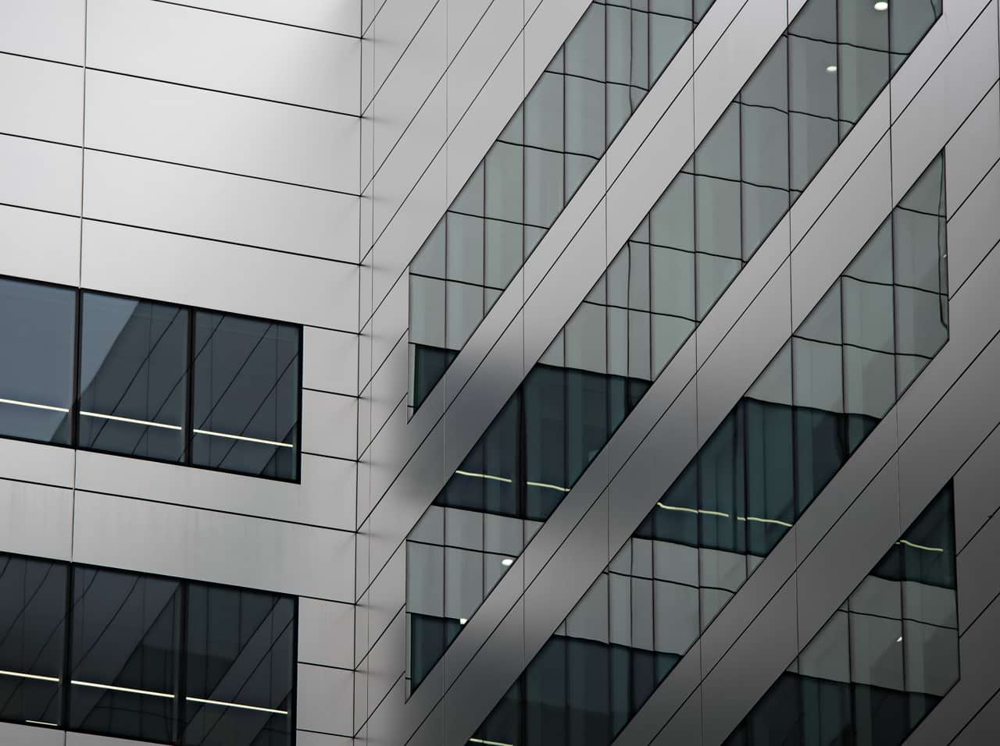

# Shadows/Highlights adjustment

Adjust the lightness of the shadows and highlights in your image.

*Before and after adjustment applied.*

Rather than applying a lighting adjustment to your entire image, making it lighter or darker, this adjustment affects the image's shadow and highlight areas and surrounding pixels.

> **Note:** This adjustment is available in [Develop Persona](../../04-develop-persona-raw/01-developing-raw-images.md) on the **Basic** and **Overlays** panels.

### Settings

The following settings can be adjusted:

- **Shadows**—controls the lightness of image shadows. Drag the slider to the left to darken shadow areas, drag to the right to lighten them.
- **Highlights**—controls the lightness of image highlights. Drag the slider to the left to darken highlight areas, drag to the right to lighten them.

#### SEE ALSO:

- [Applying adjustments](../01-applying-adjustments.md)
- [Brightness and Contrast adjustment](01-adjustment-brightnesscontrast.md)
- [Levels adjustment](04-adjustment-levels.md)
- [Curves adjustment](02-adjustment-curves.md)
