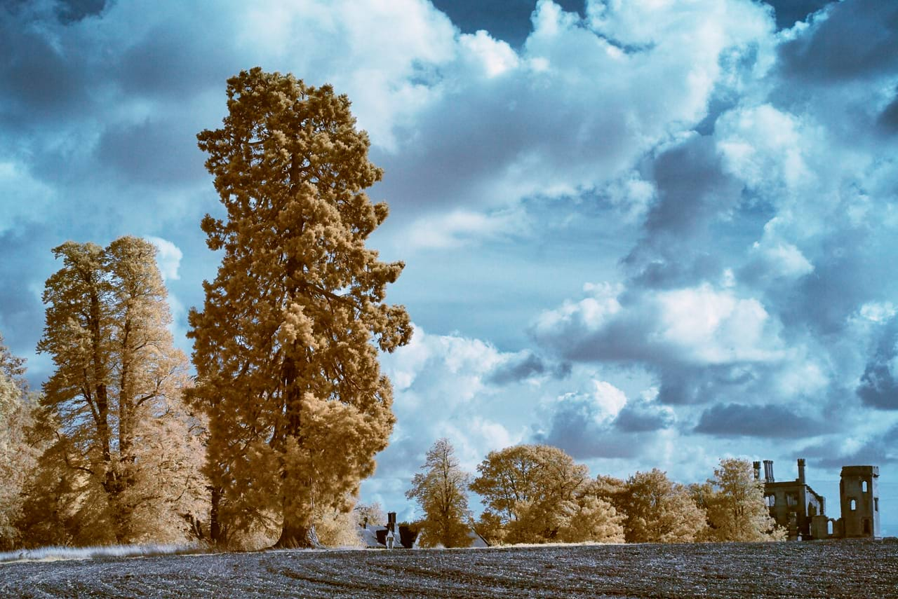
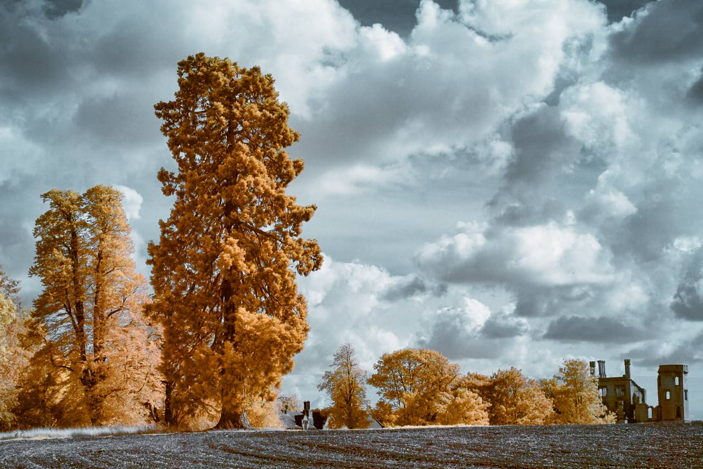

# HSL adjustment

Fine-tune the colors in your image, or even completely change them, by modifying the hue, saturation and luminosity (lightness).

*Before and after adjustment applied.*

### Settings

The following settings can be adjusted:

- **HSV**—when checked, uses the Hue Saturation Value (HSV) model instead of Hue Saturation Lightness (HSL). The Saturation Shift and Luminosity Shift sliders behave differently between the two models.
- **Color Wheel**—when using a particular channel, allows you to determine the range of colors affected by that channel (e.g., **Greens**) using four nodes located on the wheel.
- **Channel**—represented as colored circles under the wheel. Click the first (Master; multi-colored) to alter all colors at once or click any other colored circles to enable a specific color set (e.g., Reds).
- **Hue Picker**—allows you to sample a specific color family from your image on which to base your adjustment. The currently active solid color circle will be updated after picking; the Master circle cannot be color picked.
- **Hue Shift**—controls the color tint of pixels in the image. Drag the slider to shift the colors through the spectrum.
- **Saturation Shift**—controls the intensity of the colors in the image. Drag the slider to the left to decrease color intensity, drag to the right to increase it.
- **Luminosity Shift**—controls the overall brightness of the image. Drag the slider to the left to decrease brightness, drag to the right to increase it.

> **Note — Using the Channel nodes:** If choosing a specific channel, you can adjust that color's range in different ways:
>
> - Drag on an individual node to reposition it around the color circle.
> - Drag the black line that connects the colored nodes. The central line between inside nodes moves all four nodes simultaneously and in relation to each other. The black line between either outer node and its adjacent node moves just that pair of nodes independent of the other node pairing.

> **Note:** The **Hue Picker** will appear unavailable when the adjustment dialog first opens. To enable it, select any color channel first.

> **Tip:** To create a desaturated (black and white) image, position the **Saturation Shift** slider to the far left with the **Master** channel selected.

#### SEE ALSO:

- [Applying adjustments](../01-applying-adjustments.md)
- [Recolor adjustment](08-adjustment-reclr.md)
- [Black and White adjustment](02-adjustment-blackandwhite.md)
