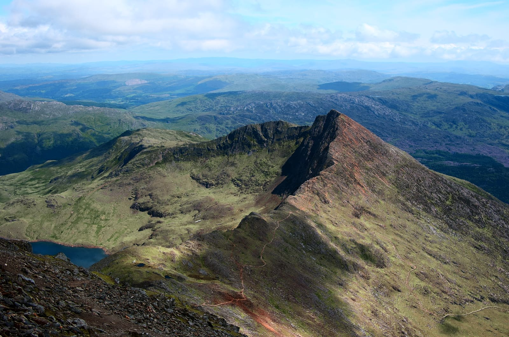

# Black & White adjustment

Convert a color image to monochrome while maintaining full control over how individual colors are converted.

This adjustment comes with a handy **Picker** setting which identifies the predominant color of a selected area and adjusts the relevant slider automatically.

> **Note:** This adjustment is available in [Develop Persona](../../04-develop-persona-raw/01-developing-raw-images.md) on the **Tones** panel.

> **Tip:** You may wish to apply a color tone, such as sepia, to the resulting grayscale image. To do this, you could use a **Recolor** adjustment or add a fill layer above with a blend mode and/or reduced opacity applied.

> **Note:** You can also create black and white images using the **HSL**, **Gradient Map**, and **Threshold** adjustments.

### Settings

The following settings can be adjusted:

- The sliders control the lightness value of the named color areas of the image. Drag the slider to the left to darken areas of the named color, drag the slider to the right to lighten them.
- **Picker**—allows you to drag on the image to modify the adjustment. The initial click will identify the predominant color, dragging left will darken areas of the identified color while dragging right will lighten them. The corresponding slider will be updated.

> **Note:** The **Picker** option is not available in Develop Persona.

#### SEE ALSO:

- [Applying adjustments](../01-applying-adjustments.md)
- [Recolor adjustment](08-adjustment-reclr.md)
- [HSL adjustment](01-adjustment-hsl.md)
- [Gradient Map adjustment](05-adjustment-gradientmap.md)
- [Threshold adjustment](11-adjustment-threshold.md)
- [Fill layers](../../06-layers/09-fill-layers.md)
