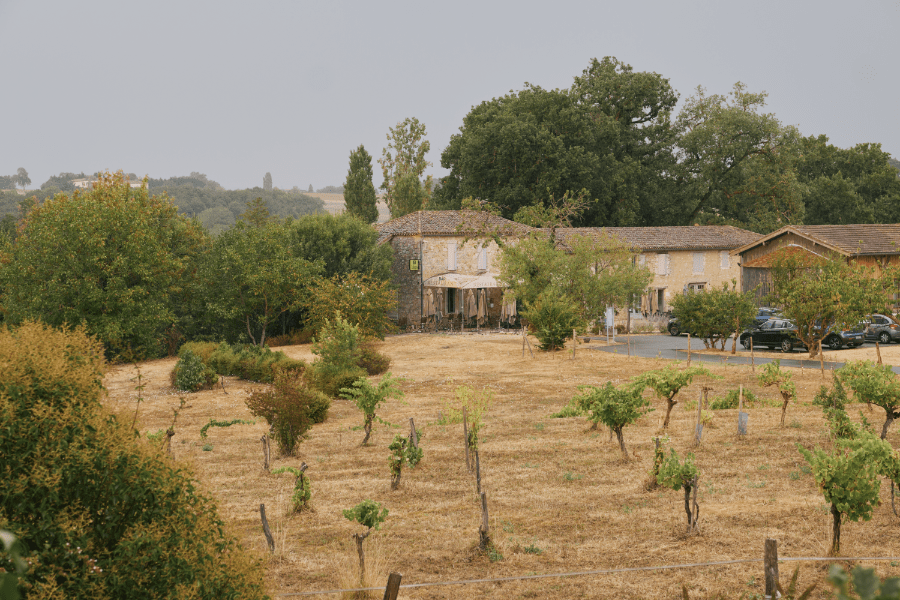
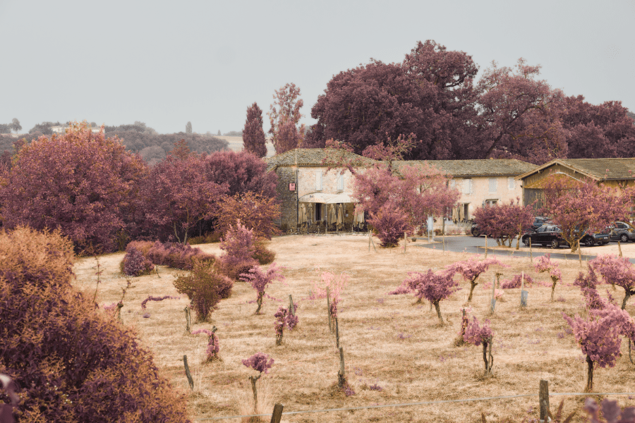

# Channel Mixer adjustment

Adjust the color of individual channels to produce effects not easily achieved with other color adjustment tools.

*Before and after channel swapping.*

> **Tip:** Adjustments can be made in any color mode, regardless of the document's current color mode.

### Settings

The following settings can be adjusted:

- **Output Channel**:
  - Select a color mode from the first pop-up menu.
  - Specify a single color channel to apply the adjustment to, including the layer's alpha channel. Select from the second pop-up menu.
- The sliders control the contribution of the named color to the selected output channel. Drag the slider to the left to decrease the level of the named color, drag the slider to the right to increase it.
- **Offset**—controls the overall influence the selected output channel has on the image as a whole. Drag the slider to the left to decrease the output channel's contribution, drag the slider to the right to increase it.

> **Tip:** Modifying the alpha channel produces a keying/matting effect.

## Channel swapping

Channel swapping is a non-destructive technique, particularly popular with images containing foliage and often used to replicate the look of infrared photography. It is achieved by using the **Channel Mixer** where Red and Blue channels have their values swapped.

**To apply the channel swapping technique:**

1. Open your image, then on the top menu select **Layer**>**New Adjustment Layer**>**Invert**.
2. Set the blend mode of the layer to Color.
3. From the top menu, select **Layer**>**New Adjustment Layer**>**Channel Mixer**.
4. In the dialog, start on the Red channel and reduce the red contribution to 0%, and increase the blue to 100%.
5. Swap to the Blue channel and here increase the red contribution to 100% while reducing the blue to 0%.
6. (Optional) On the top menu, select **Filters**>**Blur**>**Diffuse Glow** and adjust the filter's Radius and Intensity to your liking.

#### SEE ALSO:

- [Applying adjustments](../01-applying-adjustments.md)
