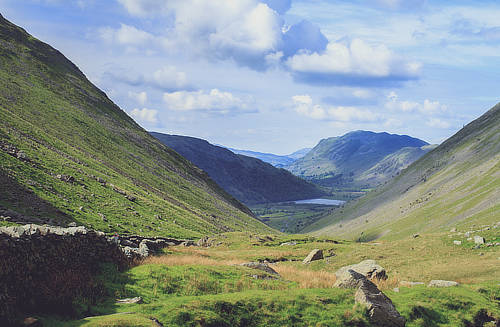
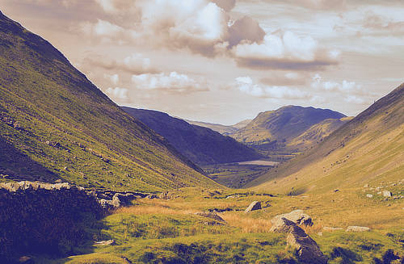

# Gradient map adjustment

The Gradient Map adjustment maps the equivalent grayscale range of an image to a specified color gradient. This provides an effective (and creative) way of recoloring an image.

*A Gradient Map applied using a custom opacity and blend mode.*

### Settings

For dialog settings, see the [Gradient and bitmap fills](../../12-color/08-gradient-and-bitmap-fills.md) topic.

> **Tip:** To create a black and white image, ensure the gradient contains only grayscale values.

#### SEE ALSO:

- [Gradient and bitmap fills](../../12-color/08-gradient-and-bitmap-fills.md)
- [Applying adjustments](../01-applying-adjustments.md)
- [Recolor adjustment](08-adjustment-reclr.md)
- [Black and White adjustment](02-adjustment-blackandwhite.md)
