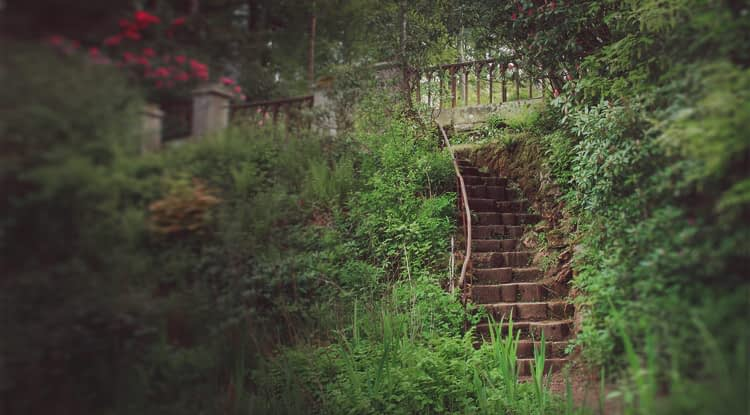
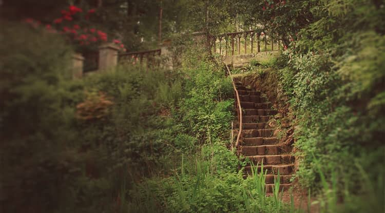

# Lens Filter adjustment

Emulates the use of a lens filter to tint the color of the image.

*Before and after adjustment applied.*

### Settings

The following settings can be adjusted:

- **Filter Color**—Choose the color/tint of your lens filter.
- **Optical Density**—Adjust the density (or strength) of the lens filter: this controls how much of the tint is blended into the image.
- **Preserve Luminosity**—When checked, prevents the change in color from affecting the luminance channel of the image. If unchecked, increasing the optical density will typically reduce the luminosity of the image.

#### SEE ALSO:

- [Applying adjustments](../01-applying-adjustments.md)
- [Recolor adjustment](08-adjustment-reclr.md)
- [Color Balance adjustment](04-adjustment-clrbalance.md)
