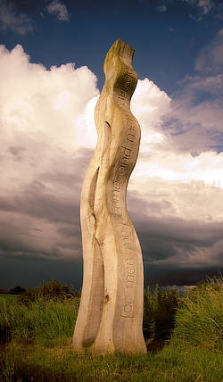

# Split Toning adjustment

Tints and recolors highlights and shadows.

*Before and after adjustment applied.*

> **Tip:** You can also perform split toning during raw image development using the **Tones** panel.

### Settings

The following settings can be adjusted:

- **Highlights Hue**—controls the color tint of highlights.
- **Highlights Saturation**—controls the intensity of the highlight colors. Drag the slider to the left to decrease color intensity, drag to the right to increase it.
- **Shadows Hue**—controls the color tint of shadows.
- **Shadows Saturation**—controls the intensity of shadow colors. Drag the slider to the left to decrease color intensity, drag to the right to increase it.
- **Balance**—controls the emphasis of the adjustment. Drag the slider to the left to emphasize highlight color, drag to the right to emphasize shadow color.

#### SEE ALSO:

- [Tones panel (Develop Persona only)](../../04-develop-persona-raw/04-tones-panel.md)
