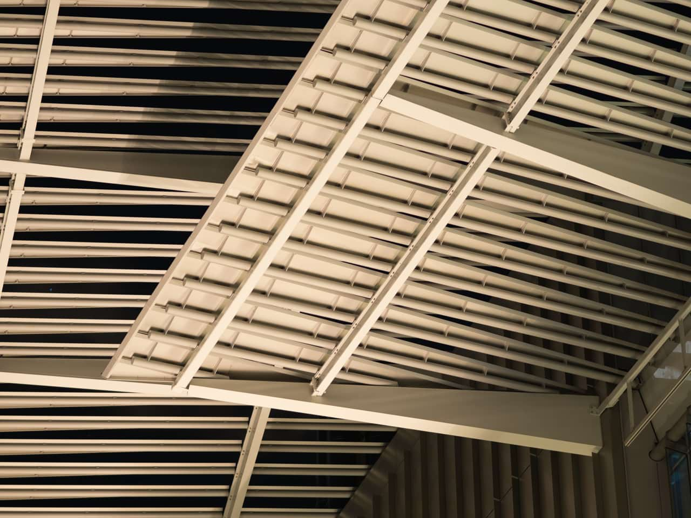
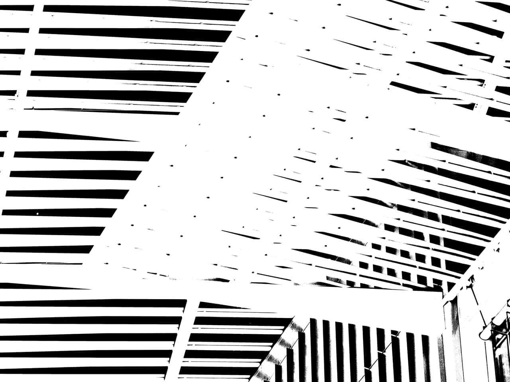

# Threshold adjustment

Create a two-tone, black and white image from grayscale or color images based on a pixel intensity threshold.

*Before and after adjustment applied.*

Any pixels lighter than the threshold are converted to white; any pixels darker than the threshold are converted to black.

### Settings

The following settings can be adjusted:

- **Threshold**—controls the transition point between pixels being converted to black or white. Drag the slider to the left to convert more pixels to white, drag the slider to the right to convert more pixels to black.

#### SEE ALSO:

- [Applying adjustments](../01-applying-adjustments.md)
- [Black and White adjustment](02-adjustment-blackandwhite.md)
