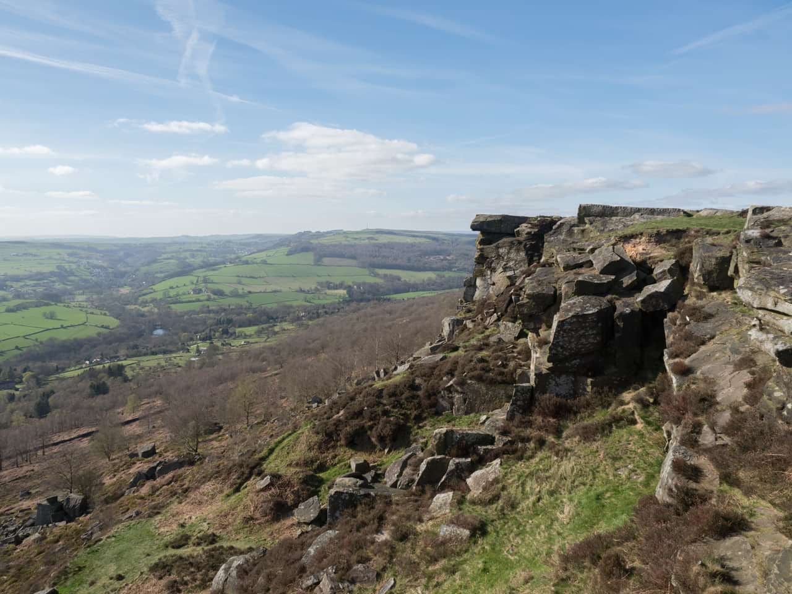
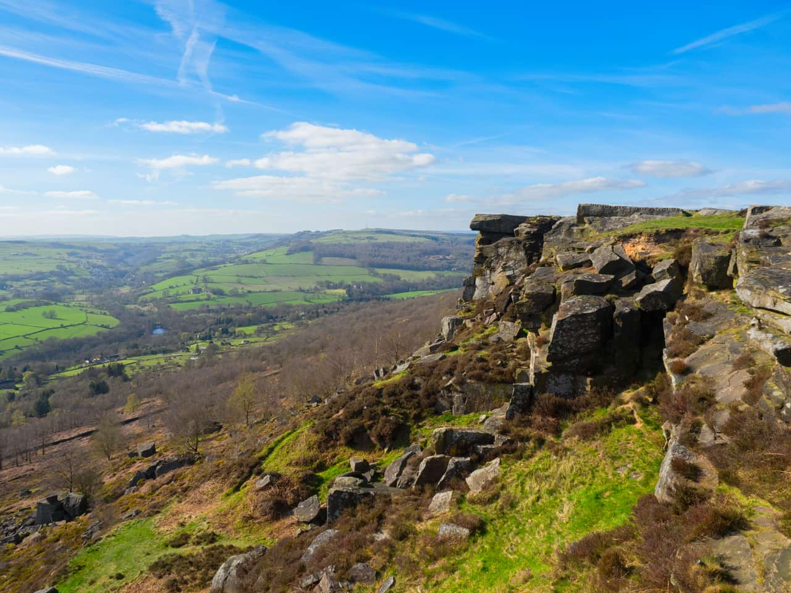

# Vibrance adjustment

Adjusts the intensity of colors in your image.

*Before and after adjustment applied.*

> **Note:** This adjustment is also available in [Develop Persona](../../04-develop-persona-raw/01-developing-raw-images.md) on the **Basic** panel (Enhance).

### Settings

The following settings can be adjusted:

- **Vibrance**—controls the intensity of colors in the image without clipping them. Drag the slider to the left to reduce color intensity, drag the slider to the right to boost subtle color intensity while minimizing the over-saturation (clipping) of more intense colors. Skin tones are also preserved to retain a natural appearance.
- **Saturation**—controls the intensity of colors in the image equally, allowing for possible clipping. Drag the slider to the left to reduce color intensity, drag the slider to the right to boost color intensity without regard to clipping, allowing for much more intense results.

#### SEE ALSO:

- [Applying adjustments](../01-applying-adjustments.md)
