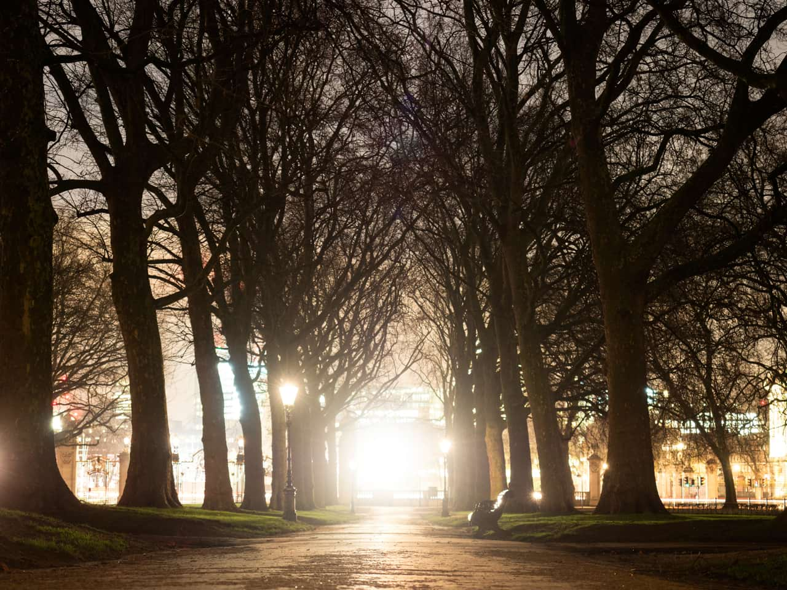
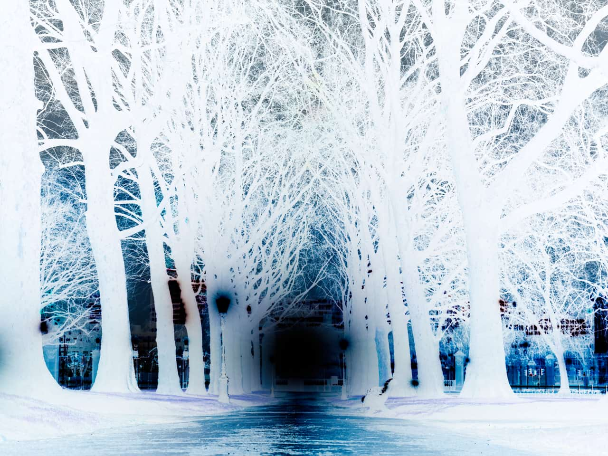

# Invert adjustment

Create a negative image by inverting all color channels.

This adjustment has no customizable settings.

> **Tip:** You can use Invert as part of the process of making edge masks and to apply sharpening and other adjustments to selected areas of an image.

> **Tip:** For more control in creating a negative-style (inverted) image, you can use a **Levels** adjustment.

#### SEE ALSO:

- [Applying adjustments](../01-applying-adjustments.md)
- [Levels adjustment](../02-tonal-adjustments/04-adjustment-levels.md)
