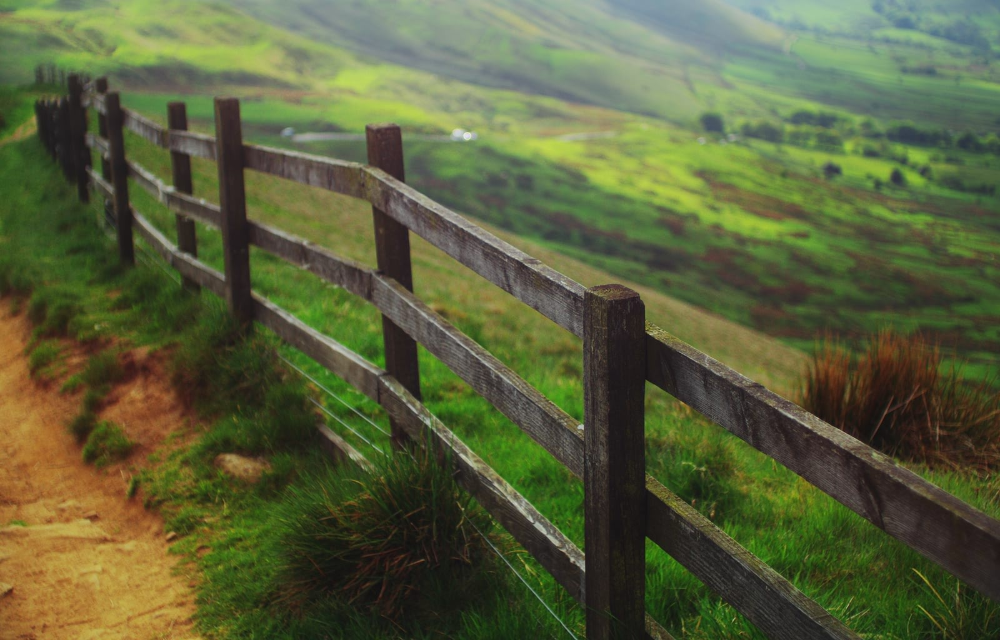
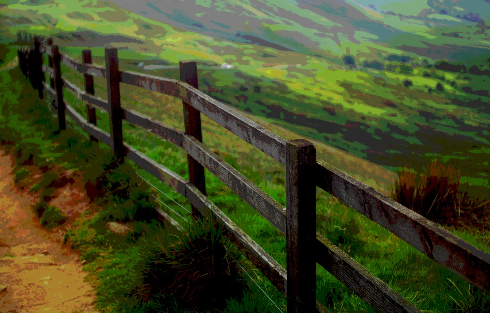

# Posterize adjustment

Creates large, flat areas of color or tone in your images.

### Settings

The following settings can be adjusted:

- **Posterize Levels**—controls the number of colored areas produced and the complexity of the resulting image. Drag the slider to the left to decrease the number of colored areas (thereby simplifying image layout), drag to the right to increase colored areas (thereby giving a more complex image layout).

> **Note:** The number displayed in the dialog represents the **level** of complexity rather than the number of resulting colors.

#### SEE ALSO:

- [Applying adjustments](../01-applying-adjustments.md)
