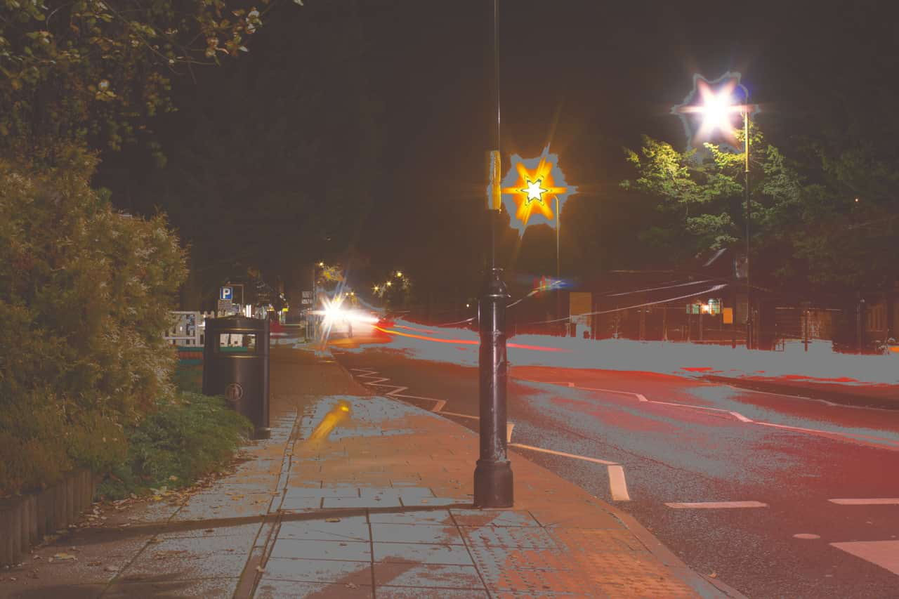

# Soft Proof adjustment

Preview the effect of creating an output for a specific color space or device.

This adjustment allows you to preview different output options for your photo or design. It can also be used creatively for tonal effects. As it behaves like a standard adjustment layer, it must be hidden or removed before exporting or sending to print, otherwise its effect will be included in the output.

### Settings

The following settings can be adjusted:

- **Proof Profile**—determines the color profile used. Select from the menu or use the up/down arrow keys to cycle through options.
- **Rendering Intent**—specifies how the adjustment converts 'source' colors to the destination color space using different intents. Select from the following:
  - **Absolute colorimetric**—adjusted colors are scaled to the white point of the source color space.
  - **Perceptual**—for out of gamut colors, the visual relationship between colors is preserved so they are perceived as natural to the human eye, even though the color values may change.
  - **Relative colorimetric**—shifts colors after making comparison between the highlights of a source color space and the destination color space, while minimizing desaturation.
- **Black point compensation**—when selected (default), the photo's black point is adjusted to honor the current contrast within the current proof profile. If this option is off, the photo's black point is not adjusted and image contrast may not be honored.
- **Gamut check**—when selected, RGB colors without a CMYK equivalent will display as gray.

#### SEE ALSO:

- [Applying adjustments](../01-applying-adjustments.md)
- [Export Persona](../../28-export-persona/01-exporting-using-export-persona.md)
- [Export](../../27-sharing/01-export.md)
- [Print](../../27-sharing/03-print.md)
