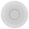
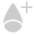
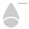

# Blur filters

Use blur filters to apply creative blurring effects to your photo.

Filters are applied to your image from the **Filters** menu (destructive) or **Layer** menu (non-destructive) and mostly include customizable settings alongside general options. Non-destructive filters are called live filters, and, once applied, they can be identified as both a filter and a specific filter type by using unique symbols.

| Filter name | Description | Regular filter    (destructive) | Live filter    (non‑destructive) with layer symbol |
| --- | --- | --- | --- |
| [Average](02-blur-filters/03-filter-average.md) | Applies a uniform color averaged across your image. |  |  |
| [Bilateral Blur](02-blur-filters/04-filter-bilateralblur.md) | Blurs while retaining high contrast. |  |   |
| [Box Blur](02-blur-filters/05-filter-boxblur.md) | Blurs based on a boxed region. |  |   |
| [Custom Blur](02-blur-filters/06-filter-customblur.md) | Applies your own blur using a customizable pixel matrix. |  |  |
| [Depth Of Field Blur](02-blur-filters/01-filter-dofblur.md) | Applies elliptical or Tilt-shift blur gradients. |  |   |
| [Diffuse Glow](02-blur-filters/07-filter-diffuseglow.md) | Blurs with a soft glow effect. |  |   |
| [Field Blur](02-blur-filters/02-filter-fieldblur.md) | Adds focal points to a blurred image. |  |   |
| [Gaussian Blur](02-blur-filters/08-filter-gaussianblur.md) | A smoothing blur for noise reduction. |  |   |
| [Lens Blur](02-blur-filters/09-filter-lensblur.md) | Simulates blurring from wide aperture lens usage. |  |   |
| [Maximum Blur](02-blur-filters/10-filter-maximumblur.md) | Broadens highlights, reduces shadows. |  |   |
| [Median Blur](02-blur-filters/11-filter-medianblur.md) | Blurs while affecting color regions. |  |   |
| [Minimum Blur](02-blur-filters/12-filter-minimumblur.md) | Shrinks highlights, increase shadows. |  |   |
| [Motion Blur](02-blur-filters/13-filter-motionblur.md) | Blurs to simulate directional movement. |  |   |
| [Radial Blur](02-blur-filters/14-filter-radialblur.md) | Gives a circular blur at a chosen position. |  |   |
| [Zoom Blur](02-blur-filters/15-filter-zoomblur.md) | blurs to simulate zooming-in motion effect. |  |  |

#### SEE ALSO:

- [Astrophotography filters](01-applying-filters/01-astrofilters.md)
- [Color filters](03-color-filters.md)
- [Distortion filters](04-distortion-filters.md)
- [Edge detection filters](05-edge-detection-filters.md)
- [Noise filters](06-noise-filters.md)
- [Sharpen filters](07-sharpen-filters.md)
- [Tonal filters](01-applying-filters/02-tonalfilters.md)
