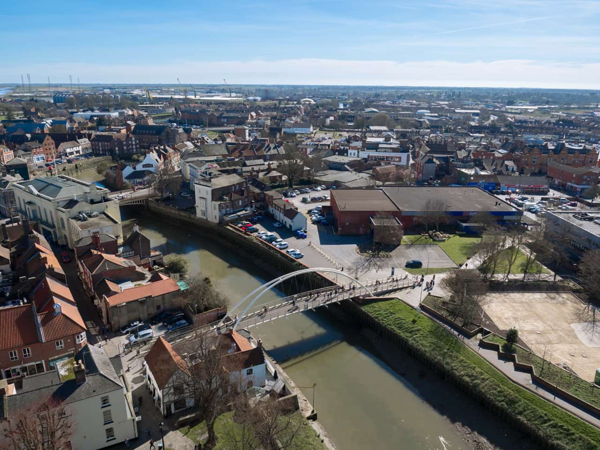
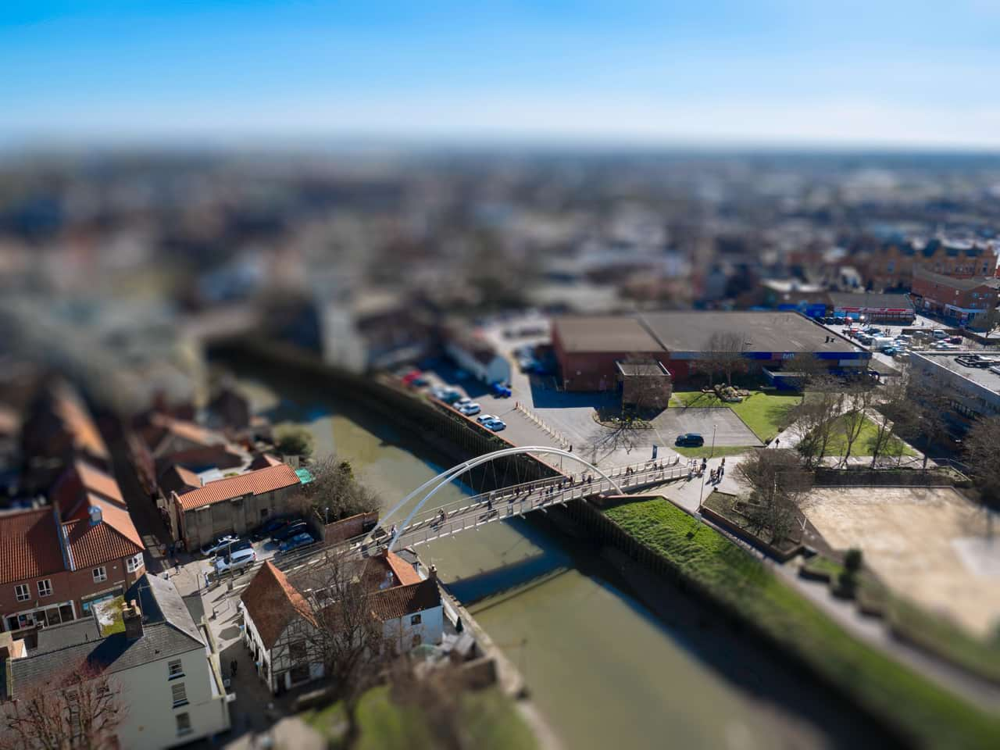
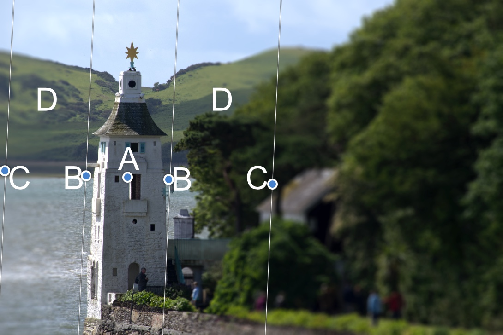

# Depth Of Field Blur filter

The Depth Of Field Blur filter applies a blur gradient that can be used to simulate extreme depth of field and miniaturization effects, such as tilt shift.

*Using the Tilt-Shift mode to produce a miniature model effect.*

## About the Depth of Field Blur filter

This filter can be applied as a [non-destructive, live filter](../../06-layers/08-using-live-filters.md). It can be accessed via the **Layer** menu, from the **New Live Filter Layer** category.

### Modes

- **Elliptical**—useful for photos with a single subject, as it creates an graduated elliptical blur vignette.
- **Tilt Shift**—often used to simulate a scene created by models.

### Settings

The following settings can be adjusted in the filter dialog:

- **Mode**—choose from the pop-up menu to define the type of blur generated.
- **Radius**—controls intensity of the blur. Type directly in the text box or drag the slider to set the value.
- **Vibrance**—controls the color intensity of less saturated colors (a high value increases the 'model-like' effect).
- **Clarity**—increases the local contrast and gives the appearance of increasing the sharpness of the image.

**Modifying the applied blur gradient**

The gradient stops determine the position and extent of the transition between the areas in sharp focus and those that are blurred.

*(A) Focus origin, (B) Inner lines, (C) Outer lines, (D) Transition areas.*

The focus origin (A) defines the central point at which the image is kept completely in focus. Reposition the focus origin by dragging on the stop.

The inner lines (B) define the width of the area in focus. For the Tilt Shift mode these can be set independently by dragging each of the stops in turn, or, symmetrically by dragging one of the stops while holding the `Cmd` . The Elliptical mode always matches the shape of the inner lines to the outer lines so that only the width can be specified.

The outer lines (C) define the end of the blur transition. For the Tilt Shift mode, these can be set independently by dragging each of the stops in turn, or, symmetrically by dragging one of the stops while holding the `Cmd` . The Elliptical mode always sets the stops in pairs.

The transition areas (D) between the inner and outer lines are where the blurring gradually increases. The wider the lines, the more gradual the transition. The area on the outside of the lines has the filter applied at the full amount set by the **Radius** slider.

The angle of the filter can be changed by dragging the stops at an angle. Once the desired angle is achieved, holding the `Shift`  will temporarily lock the angle to allow for further adjustment of the width of the adjustment.

> **Tip:** When using the tilt shift effect to "miniaturize" a scene, you will get the best effect if you choose your images carefully. Models are generally viewed from above, so the tilt shift effect will work best on images taken with an elevated viewpoint and a wide angle of view. Buildings, roads, traffic and railways make excellent subjects.

#### SEE ALSO:

- [Using live filters](../../06-layers/08-using-live-filters.md)
- [Applying filter](../01-applying-filters.md)
- [Diffuse Glow](07-filter-diffuseglow.md)
