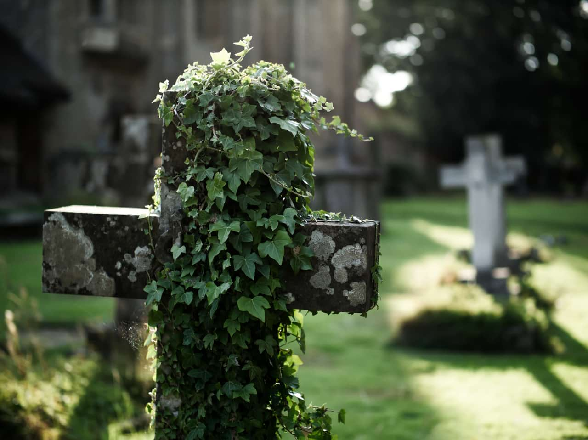
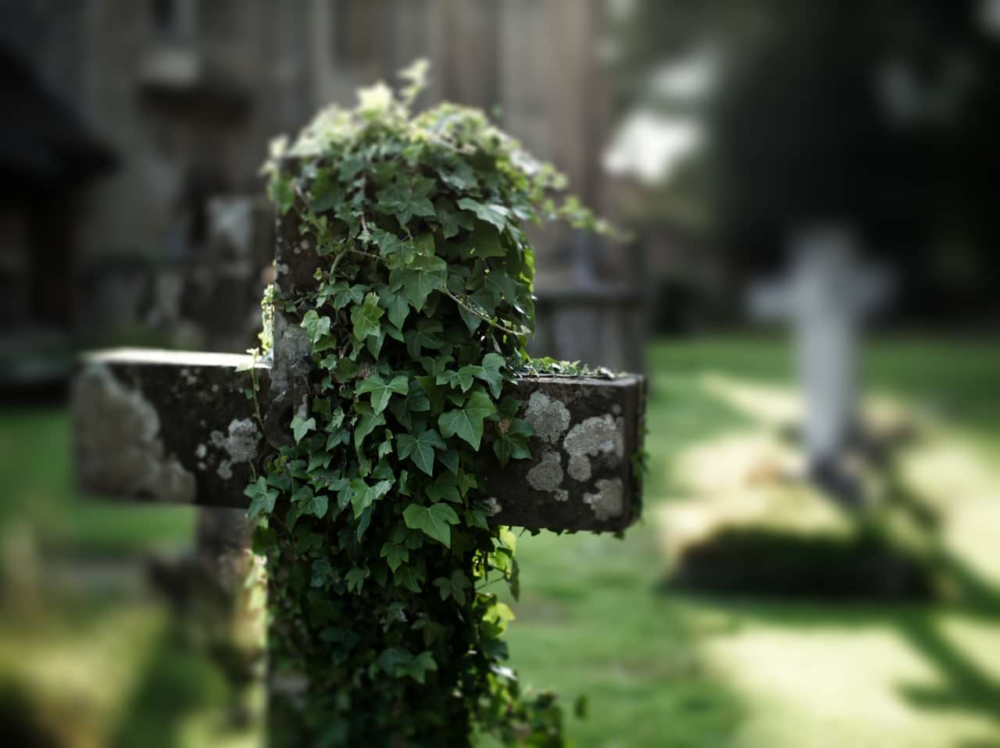

# Field Blur

The Field Blur filter lets you control blurring at specific areas of your image.

## About the Field Blur filter

Against a uniformly blurred image, one or more selection handles can be added, positioned and edited to control the extent of blurring at that handle position, i.e.the focus origin. Multiple areas of focus can therefore be created.

Handles are independent of each other and can be repositioned and edited individually.

This filter can be applied as a [non-destructive, live filter](../../06-layers/08-using-live-filters.md). It can be accessed via the **Layer** menu, from the **New Live Filter Layer** category.

### Settings

The following settings can be adjusted in the filter dialog:

- **Global Radius**—controls the intensity of the blur across the whole image. Type directly in the text box or drag the slider to set the value. Dragging to the right on the page allows you to override the maximum value—values above 100 px may affect performance so use with care.
- **Selected Handle Level**—controls the amount of blurring at the selected handle. Decreasing the value brings the image under the handle increasingly into focus.
- **Selected Handle Power**—controls the extent of the transition out from the area under the handle between sharp focus and blurring.

**To add additional selection handles:**

- Click on the page.

> **Note:** A selected handle shows as a double ring, as opposed to a single ring (deselected).

#### SEE ALSO:

- [Using live filters](../../06-layers/08-using-live-filters.md)
- [Applying filter](../01-applying-filters.md)
