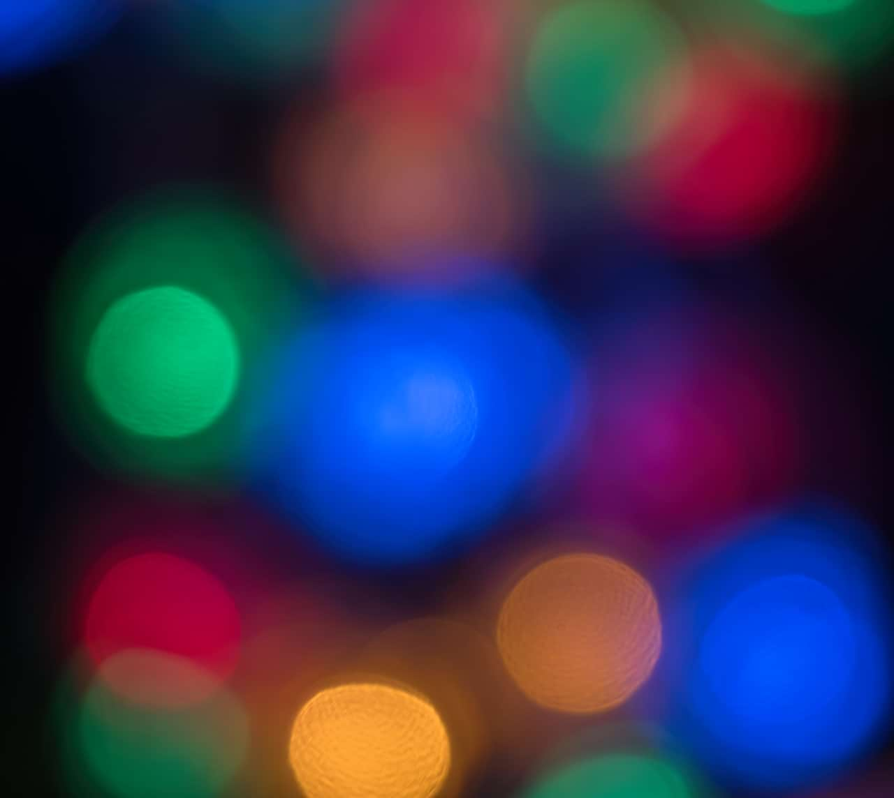

# Average

The Average filter calculates the average color in the current layer (or selection) and then applies it throughout that area.

## About the Average filter

This filter can be found in the **Filters** menu, in the **Blur** category.

This filter has no customizable settings.

#### SEE ALSO:

- [Applying filters](../01-applying-filters.md)
- [Median Blur](11-filter-medianblur.md)
- [Pixelate](../04-distortion-filters/12-filter-pixelate.md)
