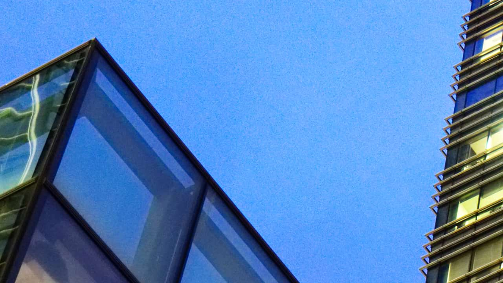

# Bilateral Blur

The Bilateral Blur filter blurs an image while retaining areas of high contrast. As these contrast changes most commonly occur at edges, it makes the filter very useful both for noise reduction and for creating interesting stylistic effects.

## About the Bilateral Blur filter

This filter can be applied as a [non-destructive, live filter](../../06-layers/08-using-live-filters.md). It can be accessed via the **Layer** menu, from the **New Live Filter Layer** category.

### Settings

The following settings can be adjusted in the filter dialog:

- **Radius**—controls the size of the area sampled for the blur. Type directly in the text box or drag the slider to set the value.
- **Tolerance**—controls whether pixels are included within the blur based on the difference between tonal values of neighboring pixels. At larger tolerance values, pixels with greater tonal differences will be included within the blur. Type directly in the text box or drag the slider to set the value.

#### SEE ALSO:

- [Using live filters](../../06-layers/08-using-live-filters.md)
- [Applying filters](../01-applying-filters.md)
- [Median Blur](11-filter-medianblur.md)
- [Custom Blur](06-filter-customblur.md)
