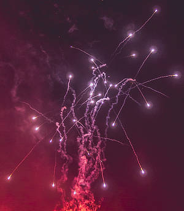
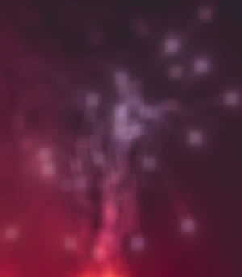

# Box Blur

The Box Blur filter blurs an image based on the average color of neighboring pixels. At high radius levels, this results in an obvious 'box' effect. At lower radius levels, it results in an effect similar to [Gaussian Blur](08-filter-gaussianblur.md).

## About the Box Blur filter

This filter can be applied as a [non-destructive, live filter](../../06-layers/08-using-live-filters.md). It can be accessed via the **Layer** menu, from the **New Live Filter Layer** category.

### Settings

The following settings can be adjusted in the filter dialog:

- **Radius**—controls intensity of the filter. Type directly in the text box or drag the slider to set the value. Dragging to the right on the page allows you to override the maximum value—values above 100 px may affect performance so use with care.

#### SEE ALSO:

- [Using live filters](../../06-layers/08-using-live-filters.md)
- [Applying filters](../01-applying-filters.md)
- [Gaussian Blur](08-filter-gaussianblur.md)
