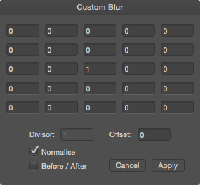

# Custom Blur

The Custom Blur filter allows you to construct your own filter to apply a customized blur.

*Custom Blur matrix window.*

## About the Custom Blur filter

When this blur filter is applied to an image, each pixel's brightness value is recalculated according to the customized formula.

The cells in the matrix represent a target pixel (at the center) and its surrounding pixels. Numbers in these cells are multipliers ("coefficients") by which each pixel's brightness will be multiplied. The filter examines each pixel, takes the sum of all these multiplications, and comes up with a new value for each target pixel. If a cell's value is 0, the corresponding pixel makes no contribution to the recalculated value of the target pixel.

This filter can be found in the **Filter** menu, in the **Blur** category.

### Settings

The following settings can be adjusted in the filter dialog:

- Matrix cell—sets the multiplier used to determine pixel brightness. Type directly in the text box or use the arrow s to set the value.
- **Divisor**—sets the value by which the overall multiplied brightness is divided. Type directly in the text box to set the value.
- **Offset**—adjusts the overall brightness. Positive values increase the overall brightness, negative values decrease the overall brightness. Type directly in the text box to set the value.
- **Normalize**— when selected (default), the Divisor is automatically set to the sum of all the values set in the matrix cells to maintain the overall lightness of the original image. If this option is off, the Divisor can be adjusted manually.

#### SEE ALSO:

- [Applying filters](../01-applying-filters.md)
- [Bilateral Blur](04-filter-bilateralblur.md)
- [Median Blur](11-filter-medianblur.md)
