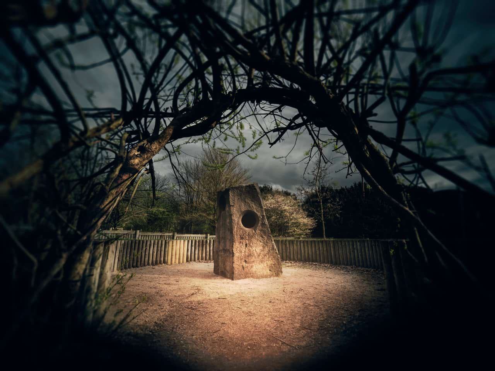
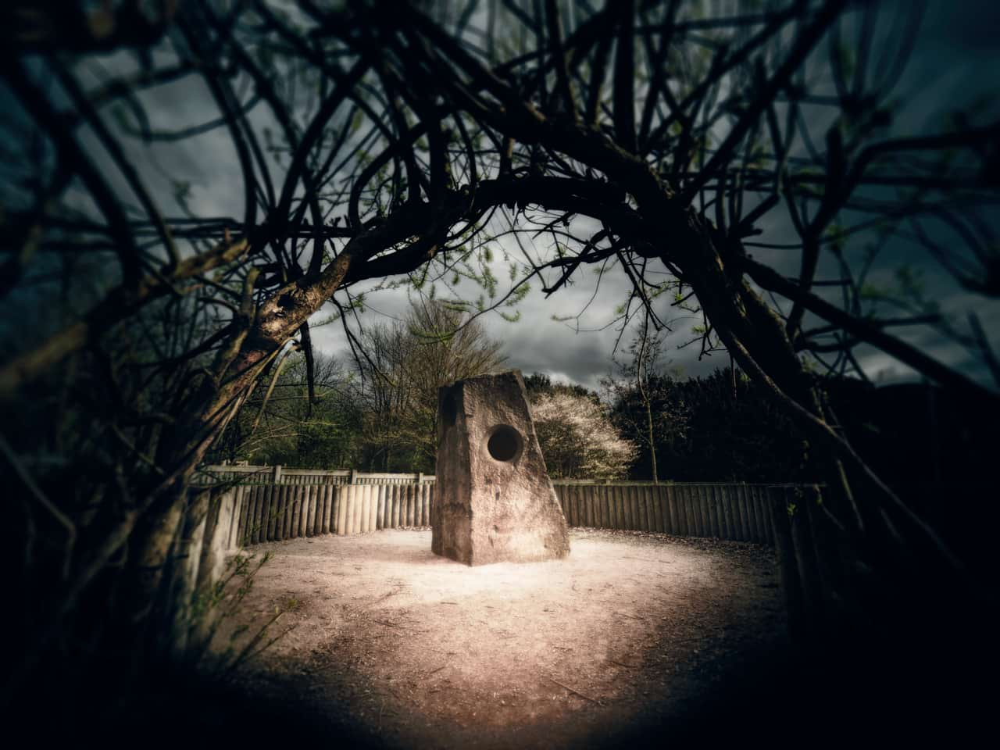

# Diffuse Glow

Diffuse Glow broadens highlights in the active layer or selection by brightening gradually outward from existing highlights, producing a soft halo effect. This creates a romantic, almost dreamy effect, similar to that of photographing an image through a soft diffusion filter.

*Using diffuse glow to add intensity and softness to the highlights of an image.*

## About the Diffuse Glow filter

This filter can be applied as a [non-destructive, live filter](../../06-layers/08-using-live-filters.md). It can be accessed via the **Layer** menu, from the **New Live Filter Layer** category.

### Settings

The following settings can be adjusted in the filter dialog:

- **Radius**—controls how much the pixels surrounding the highlights are affected. Type directly in the text box or drag the slider to set the value.
- **Intensity**—controls the strength of the highlights. Type directly in the text box or drag the slider to set the value.
- **Threshold**—determines the range of lightness values affected. As the tolerance decreases, the effect spreads to areas that were darker to begin with. Type directly in the text box or drag the slider to set the value.
- **Opacity**—alters the transparency of the effect. Type directly in the text box or drag the slider to set the value.

#### SEE ALSO:

- [Using live filters](../../06-layers/08-using-live-filters.md)
- [Applying filter](../01-applying-filters.md)
- [Depth Of Field Blur](01-filter-dofblur.md)
