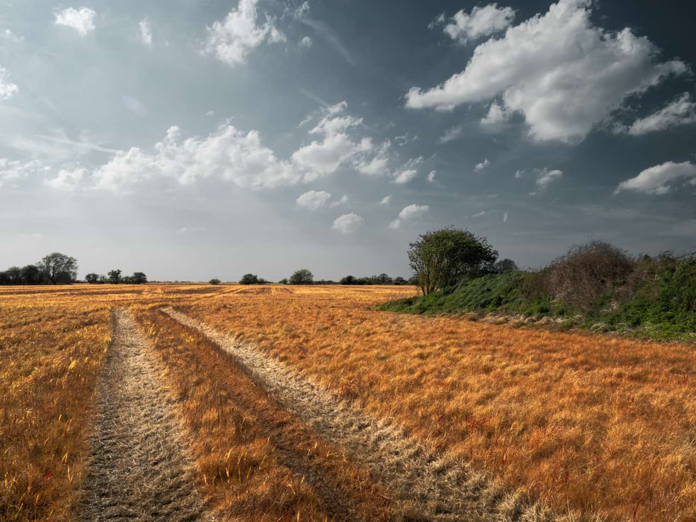

# Gaussian Blur

The Gaussian Blur filter is used to reduce image noise or detail by creating a pleasing, smooth blur using a weighted average. It's especially useful for reducing moiré (interference) patterns.

*A Live Gaussian Blur filter with an Overlay blend mode for a soft, diffuse glow look.*

## About the Gaussian Blur filter

This filter can be applied as a [non-destructive, live filter](../../06-layers/08-using-live-filters.md). It can be accessed via the **Layer** menu, from the **New Live Filter Layer** category.

### Settings

The following settings can be adjusted in the filter dialog:

- **Radius**—controls how much dissimilar pixels are blurred. Type directly in the text box or drag the slider to set the value. Dragging to the right on the page allows you to override the maximum value—values above 100 px may affect performance so use with care.

#### SEE ALSO:

- [Using live filters](../../06-layers/08-using-live-filters.md)
- [Applying filters](../01-applying-filters.md)
- [Box Blur](05-filter-boxblur.md)
- [Median Blur](11-filter-medianblur.md)
