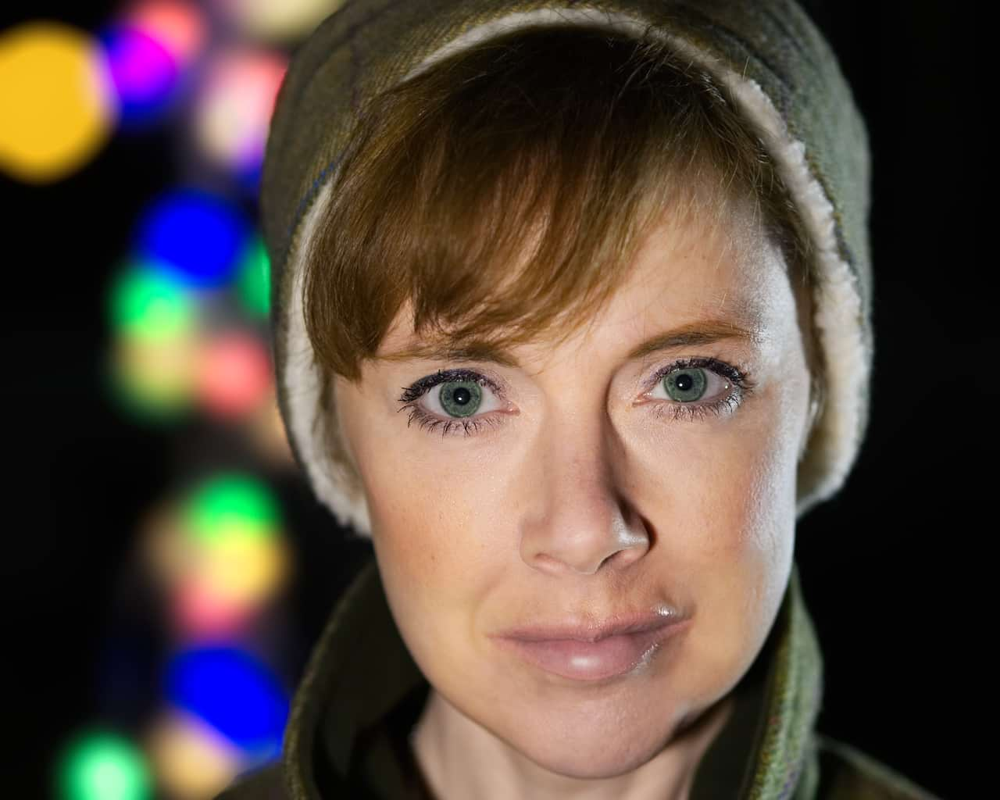

# Lens Blur

The Lens Blur filter mimics the blur applied to a photo when a wide aperture is used to achieve a narrow depth of field. It can be used to improve the composition of a photo by applying a shallow depth of field to blur unwanted background. Unlike the [Gaussian Blur](08-filter-gaussianblur.md) filter, the Lens Blur filter recreates the bokeh effects generated with a real camera lens.

## About the Lens Blur filter

This filter can be applied as a [non-destructive, live filter](../../06-layers/08-using-live-filters.md). It can be accessed via the **Layer** menu, from the **New Live Filter Layer** category.

### Settings

The following settings can be adjusted in the filter dialog:

- **Radius**—controls the number of pixels affected. Type directly in the text box or drag the slider to set the value. Dragging to the right on the page allows you to override the maximum value—values above 100 px may affect performance so use with care.
- **Number of Blades**—sets the number of virtual aperture blades which controls the shape of the 'iris' and the shape of the specular highlights. Type directly in the text box or drag the slider to set the value.
- **Blade Curvature**—sets how round the iris shape becomes. Type directly in the text box or drag the slider to set the value.
- **Bloom Threshold**—controls the border of the bloom effect. Type directly in the text box or drag the slider to set the value.
- **Bloom Factor**—controls the extent of the bloom effect. Type directly in the text box or drag the slider to set the value.
- **Bloom Color**—defines the color of the bloom effect. Type directly in the text box or drag the slider to define the hue.

> **Note:** The shape of the iris affects the shape of the specular highlights (bokeh). The most noticeable bokeh shapes are created using a low blade curvature and fewer aperture blades. To mimic the effects of your own lenses, be sure to match the number of aperture blades.

#### SEE ALSO:

- [Using live filters](../../06-layers/08-using-live-filters.md)
- [Applying filters](../01-applying-filters.md)
- [Motion Blur](13-filter-motionblur.md)
- [Radial Blur](14-filter-radialblur.md)
- [Zoom Blur](15-filter-zoomblur.md)
