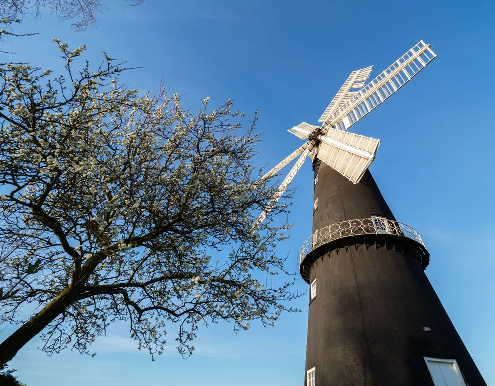
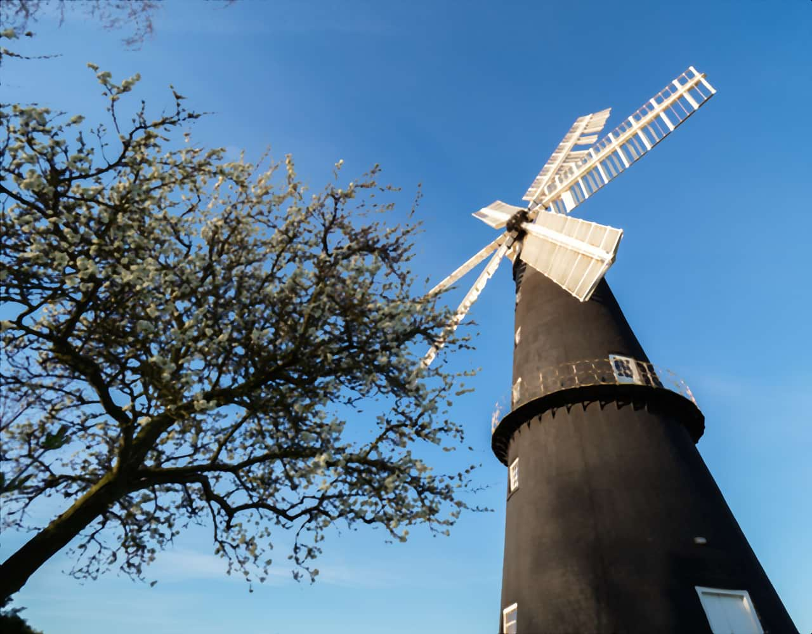

# Median Blur

The Median Blur filter broadens color regions in the image. At low settings it’s useful for removing noise, especially as it retains edges better than [Gaussian Blur](08-filter-gaussianblur.md). At much higher intensities it introduces flat areas of color.

*Median Blur on a photograph.*

## About the Median Blur filter

This filter can be applied as a [non-destructive, live filter](../../06-layers/08-using-live-filters.md). It can be accessed via the **Layer** menu, from the **New Live Filter Layer** category.

### Settings

The following settings can be adjusted in the filter dialog:

- **Radius**—controls intensity of the filter. At high levels it creates large, flat areas of color. Type directly in the text box or drag the slider to set the value. Dragging to the right on the page allows you to override the maximum value—values above 100 px may affect performance so use with care.

#### SEE ALSO:

- [Using live filters](../../06-layers/08-using-live-filters.md)
- [Applying filters](../01-applying-filters.md)
- [Gaussian Blur](08-filter-gaussianblur.md)
- [Bilateral Blur](04-filter-bilateralblur.md)
