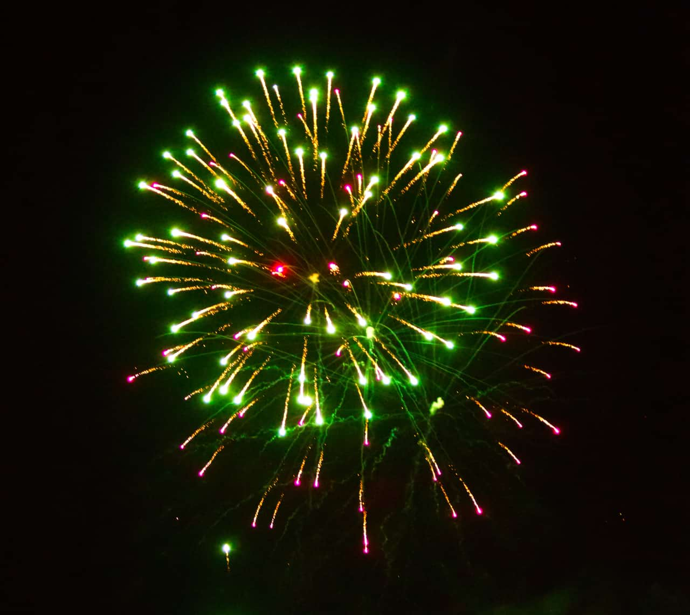
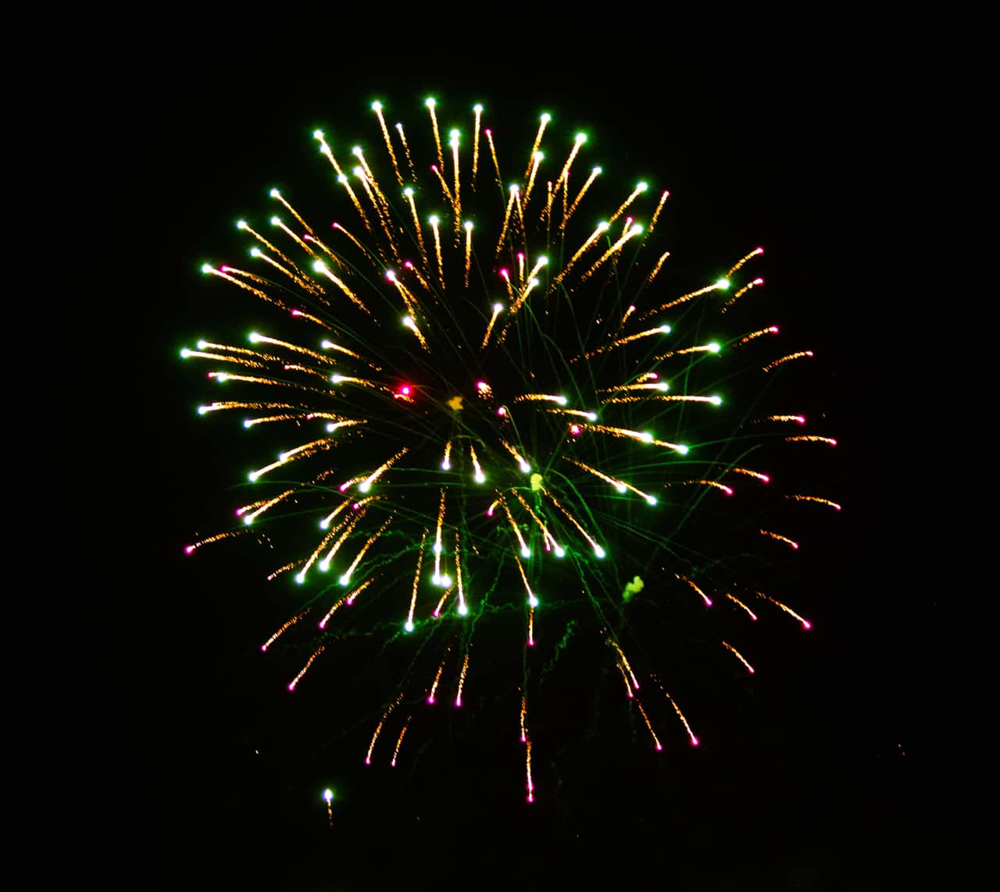

# Minimum Blur

The Minimum Blur filter shrinks highlight regions in the image, and broadens darker areas. It works by comparing each pixel to its neighbor and replaces lighter pixels with darker pixels. This is most useful for modifying masks.

## About the Minimum Blur filter

This filter can be applied as a [non-destructive, live filter](../../06-layers/08-using-live-filters.md). It can be found in the **Filters** menu, in the **Blur** category.

### Settings

The following settings can be adjusted in the filter dialog:

- **Radius**—controls intensity of the filter. Type directly in the text box or drag the slider to set the value. Dragging to the right on the page allows you to override the maximum value—values above 100 px may affect performance so use with care.
- **Circular**—if this option is off (default), darker regions expand to form square areas. When selected, expanded darker regions are circular.

#### SEE ALSO:

- [Applying filters](../01-applying-filters.md)
- [Maximum Blur](10-filter-maximumblur.md)
