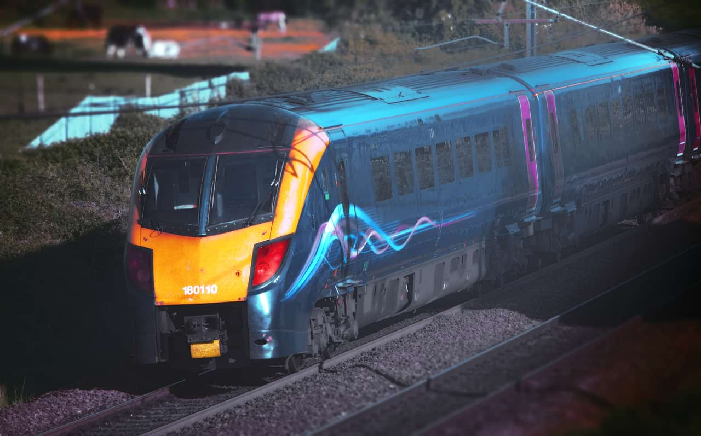
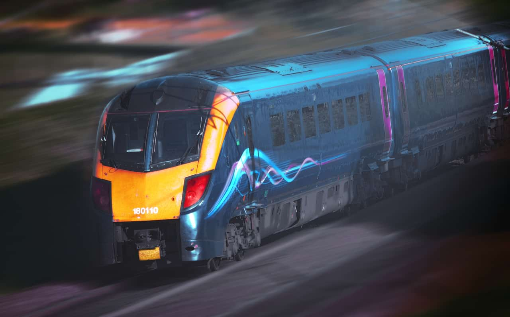

# Motion Blur

The Motion Blur filter blurs in a specified direction to give the impression of movement. This gives an effect similar to panning with a camera at slower shutter speeds.

*Motion Blur can add the impression of speed or movement to images.*

## About the Motion Blur filter

This filter can be applied as a [non-destructive, live filter](../../06-layers/08-using-live-filters.md). It can be accessed via the **Layer** menu, from the **New Live Filter Layer** category.

### Settings

The following settings can be adjusted in the filter dialog:

- **Radius**—controls the amount of 'zoom'. Type directly in the text box or drag the slider to set the value. Dragging to the right on the page allows you to override the maximum value—values above 100 px may affect performance so use with care.
- **Rotation**—controls the angle at which the blur is applied. Drag the dial to set the value.

#### SEE ALSO:

- [Using live filters](../../06-layers/08-using-live-filters.md)
- [Applying filters](../01-applying-filters.md)
- [Radial Blur](14-filter-radialblur.md)
- [Zoom Blur](15-filter-zoomblur.md)
- [Lens Blur](09-filter-lensblur.md)
