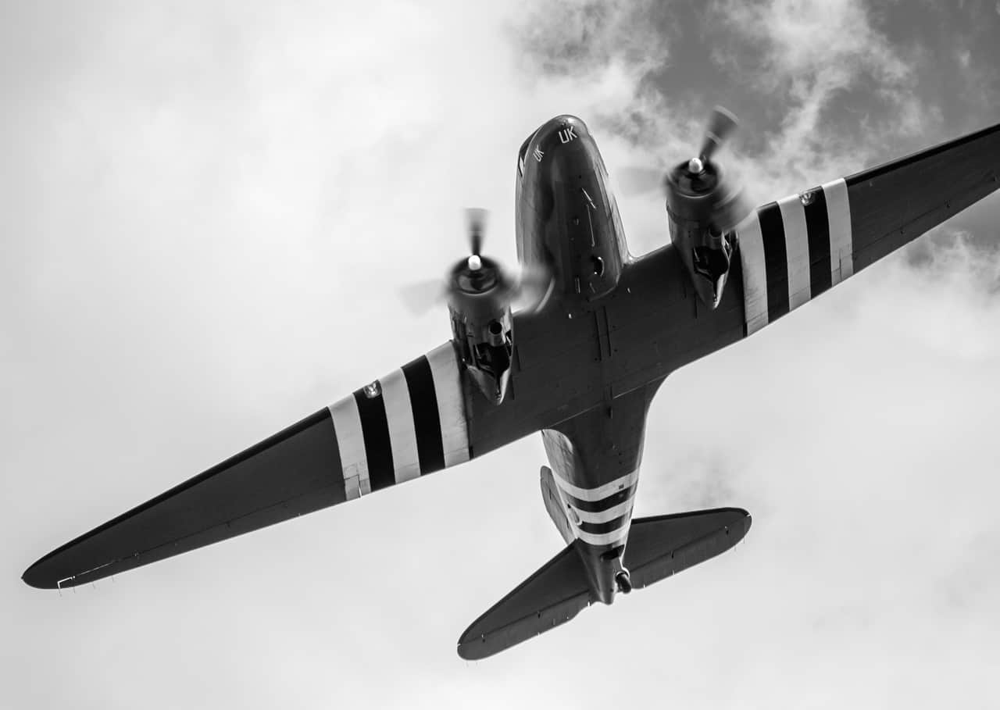

# Radial Blur

The Radial Blur filter creates blur in concentric circular lines from an origin point. This gives the impression of movement and rotation, similar to the effect of a fast rotating object taken at a slower shutter speed.

## About the Radial Blur filter

This filter can be applied as a [non-destructive, live filter](../../06-layers/08-using-live-filters.md). It can be found in the **Filters** menu, in the **Blur** category.

> **Note:** Drag on the image to set the origin.

### Settings

The following settings can be adjusted in the filter dialog:

- **Angle**—controls the amount of 'spin'. Type directly in the text box or drag the slider to set the value.

#### SEE ALSO:

- [Applying filters](../01-applying-filters.md)
- [Motion Blur](13-filter-motionblur.md)
- [Zoom Blur](15-filter-zoomblur.md)
- [Lens Blur](09-filter-lensblur.md)
