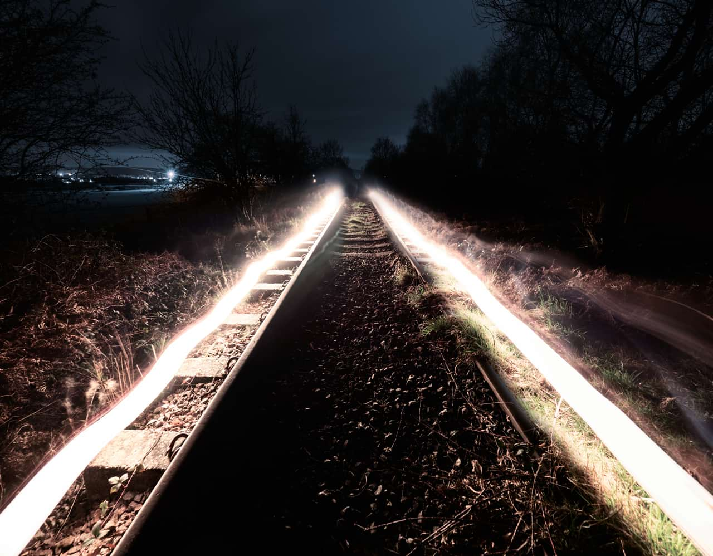

# Zoom Blur

The Zoom Blur filter applies converging streaks from an origin point. This gives the impression of movement, similar to the effect of using a long exposure while zooming in to a subject.

*Using Zoom Blur to convey power and sound..*

## About the Zoom Blur filter

This filter can be found in the **Filters** menu, in the **Blur** category.

> **Note:** Drag on the image to set the origin.

### Settings

The following settings can be adjusted in the filter dialog:

- **Radius**—controls the amount of 'zoom'. Type directly in the text box or drag the slider to set the value.

#### SEE ALSO:

- [Applying filters](../01-applying-filters.md)
- [Motion Blur](13-filter-motionblur.md)
- [Radial Blur](14-filter-radialblur.md)
- [Lens Blur](09-filter-lensblur.md)
