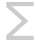

# Color filters

Use color filters to add creative color effects or correct color anomalies in your photo.

Filters are applied to your image from the **Filters** menu (destructive) or **Layer** menu (non-destructive) and mostly include customizable settings alongside general options. Non-destructive filters are called live filters, and, once applied, they can be identified as both a filter and a specific filter type by using unique symbols.

| Filter name | Description | Regular filter    (destructive) | Live filter    (non‑destructive) with layer symbol |
| --- | --- | --- | --- |
| [Chromatic Aberration](03-color-filters/01-filter-chromaticaberration.md) | Removes lens-related color fringing automatically. |  |  |
| [Defringe](03-color-filters/02-filter-defringe.md) | Remove color fringing by sampling. |  |   |
| [Divide by Alpha](03-color-filters/03-filter-dividebyalpha.md) | Ensures transparency in an image is stored using a non-premultiplied alpha representation. |  |  |
| [Emboss](03-color-filters/04-filter-emboss.md) | Creates a convex rounded-edge effect. |  |  |
| [Erase White Paper](03-color-filters/05-filter-erasewhitepaper.md) | Intelligently removes white and replaces with transparency. |  |  |
| [Halftone](03-color-filters/06-filter-halftone.md) | Simulates continuous tone reproduction. |  |   |
| [Monochrome Dither](03-color-filters/07-filter-monochromedither.md) | Converts the image to black and white monochrome. |  |  |
| [Multiply by Alpha](03-color-filters/08-filter-multiplybyalpha.md) | Ensures transparency in an image is stored using a premultiplied alpha representation. |  |  |
| [Procedural Texture](03-color-filters/09-filter-proceduraltexture.md) | Allows you to create your own filter effects through functions, expressions and variables. |  |   |
| [Remove Black Matte](03-color-filters/10-filter-removeblackmatte.md) | Removes black color fringing around a cut-out automatically. |  |  |
| [Remove Vignette](03-color-filters/12-filter-removevignette.md) | Fixes unwanted vignetting around your image. |  |  |
| [Remove White Matte](03-color-filters/11-filter-removewhitematte.md) | Removes white color fringing around a cut-out automatically. |  |  |
| [Solarize](03-color-filters/13-filter-solarize.md) | Sets lightness above which image colors are inverted. |  |  |
| [Vignette](03-color-filters/14-filter-vignette.md) | Adds an elliptical surround to your image. |  |   |
| [Voronoi](03-color-filters/15-filter-voronoi.md) | Creates a Voronoi diagram (Dirichlet tessellation). |  |   |
| [Web Safe Dither](03-color-filters/16-filter-websafedither.md) | Makes your image web safe by reducing colors. |  |  |

#### SEE ALSO:

- [Astrophotography filters](01-applying-filters/01-astrofilters.md)
- [Blur filters](02-blur-filters.md)
- [Distortion filters](04-distortion-filters.md)
- [Edge detection filters](05-edge-detection-filters.md)
- [Noise filters](06-noise-filters.md)
- [Sharpen filters](07-sharpen-filters.md)
- [Tonal filters](01-applying-filters/02-tonalfilters.md)
