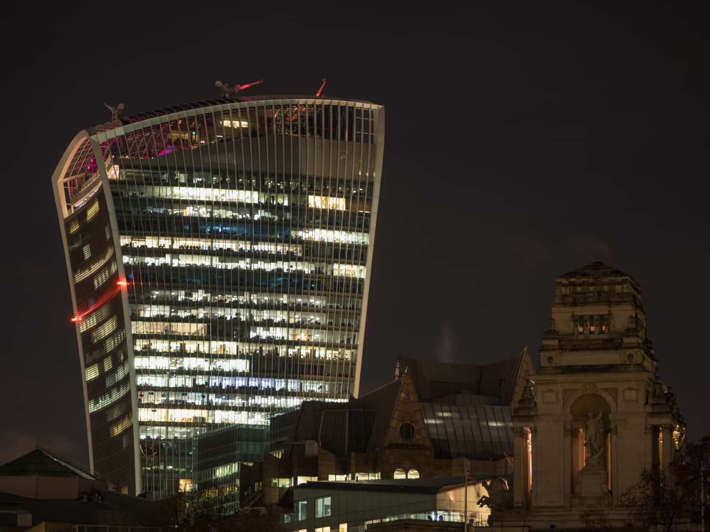
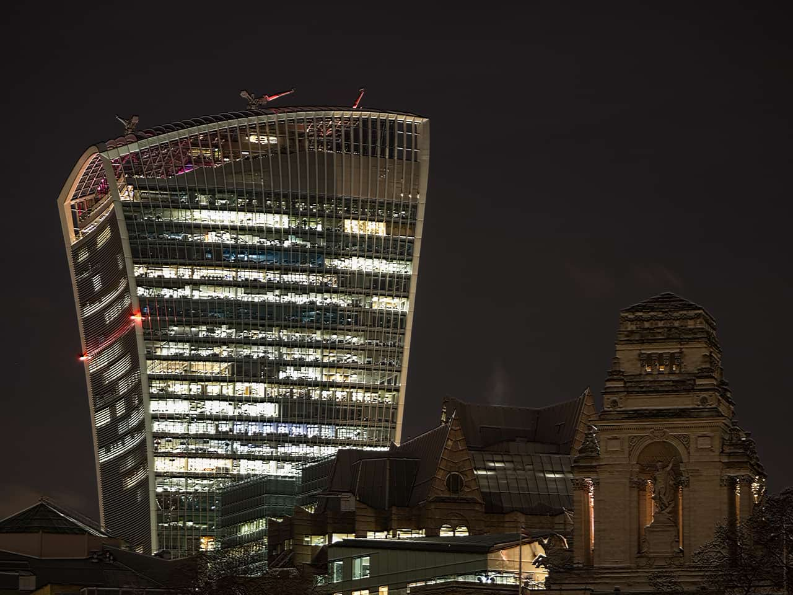

# Emboss

The Emboss filter uses the contrast of an image to remap contours to create a 3D effect, similar to bas-relief. Like many of the other filters, it's very versatile and most useful when combined with other techniques.

*Using Emboss on a duplicate layer with its blend mode set to "Saturation".*

## About the Emboss filter

This filter can be found in the **Filter** menu, in the **Colors** category.

### Settings

The following settings can be adjusted in the effects dialog:

- **Radius**—controls the number of pixels affected. Type directly in the text box or drag the slider to set the value.
- **Amount**—controls the intensity of the filter. Type directly in the text box or drag the slider to set the value.
- **Rotation**—controls the angle of the lighting. Drag the dial to set the value.
- **Monochrome**—when selected, the final effect only contains grayscale values.

> **Tip:** This filter can effectively sharpen images suffering from small amounts of motion blur.

#### SEE ALSO:

- [Applying filter](../01-applying-filters.md)
