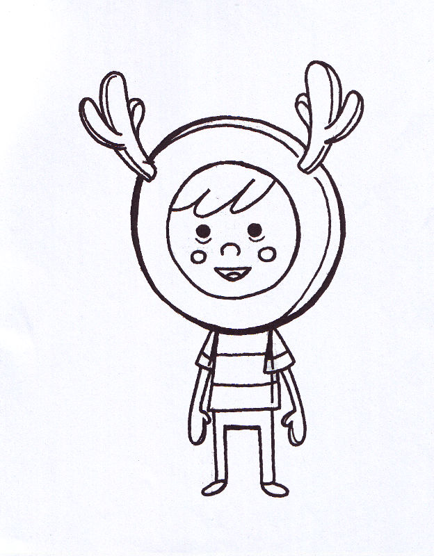

# Erase White Paper

The Erase White Paper filter applies transparency to white areas of an image to remove them. All other colors remain unaffected.

*Using the filter to remove white paper from a scanned document.*

## About the Erase White Paper filter

The filter is really useful if want to use line art previously drawn on physical media (paper). After scanning, the areas of scanned white paper can be stripped away by using the filter, allowing coloring and texture to be added to complete the design.

This filter can be found in the **Filter** menu, in the **Colors** category.

This filter has no customizable settings.

#### SEE ALSO:

- [Applying filters](../01-applying-filters.md)
