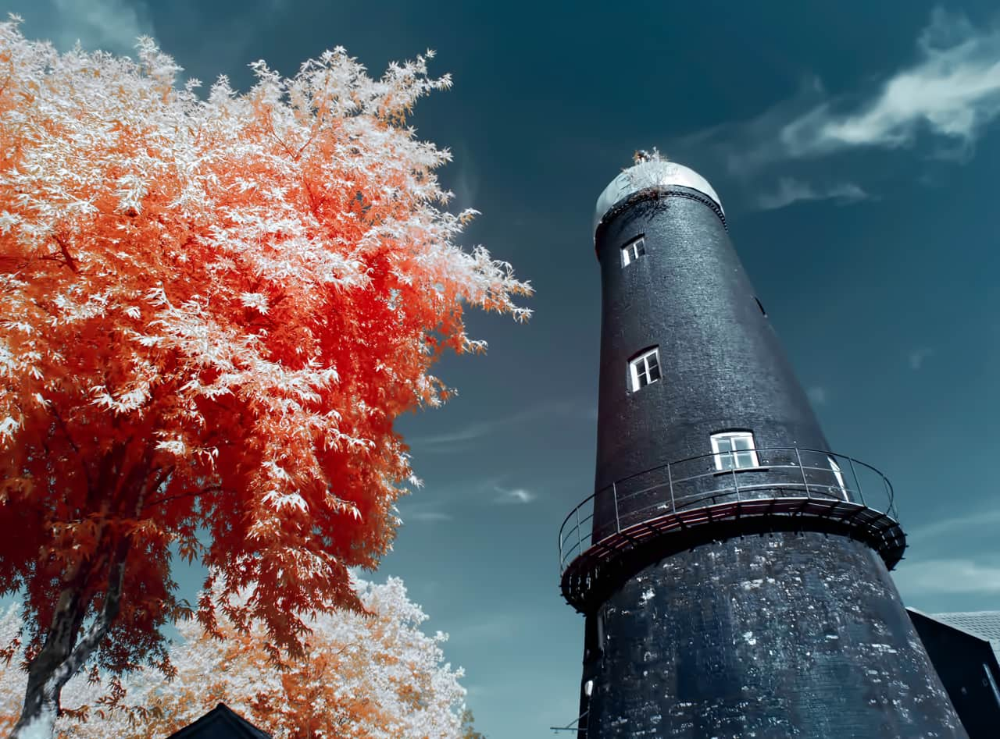
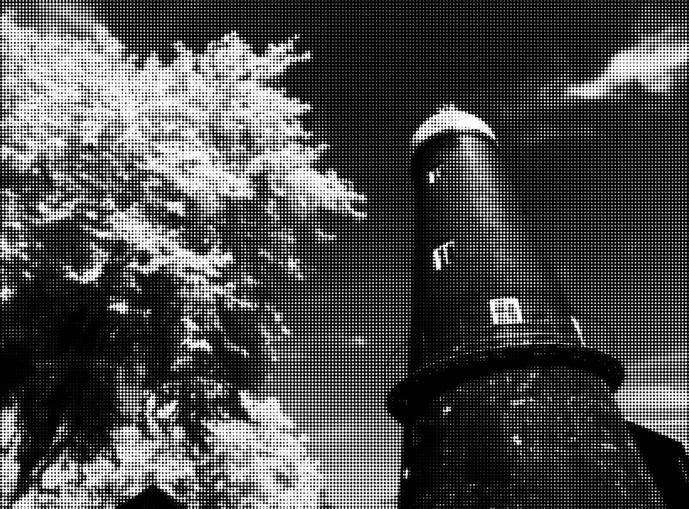

# Halftone

The Halftone filter simulates the look of continuous tone through a choice of screen types.

This filter can be applied as a [non-destructive, live filter](../../06-layers/08-using-live-filters.md). It can be accessed via the **Layer** menu, from the **New Live Filter Layer** category.

### Settings

The following settings can be adjusted in the filter dialog:

- **Screen**—provides a choice of how the continuous tone is generated from **Monochrome**, **Color**, **Line** or **Circular**.
- **Dot**—determines the operator used to generate the dot tone. Choose from **Cosine** (smooth) or **Round** (sharp). Only applicable when **Screen** is set to **Monochrome** or **Color**.
- **Cell Size**—dictates the size of each individual dot, line or circle that makes up the continuous tone.
- **Contrast**—increases or decreases the tonal contrast between each cell.
- **Grey Component Replacement**—(Color screen type only) controls the contrast of areas between color cells.
- **Under Color Removal**—(Color screen type only) controls the influence of the color cells. Increase to lessen their influence and desaturate the image.
- **Screen Angle**—changes the direction of the tone reproduction.

#### SEE ALSO:

- [Voronoi Filter](15-filter-voronoi.md)
- [Applying filters](../01-applying-filters.md)
