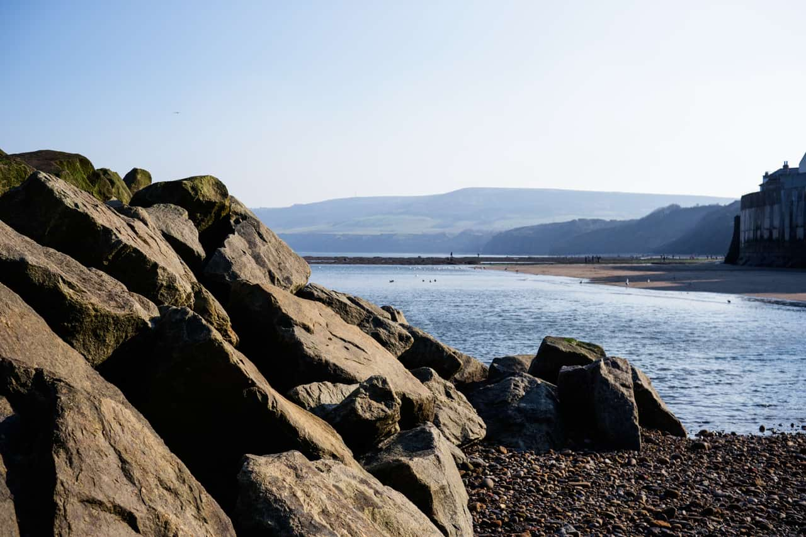
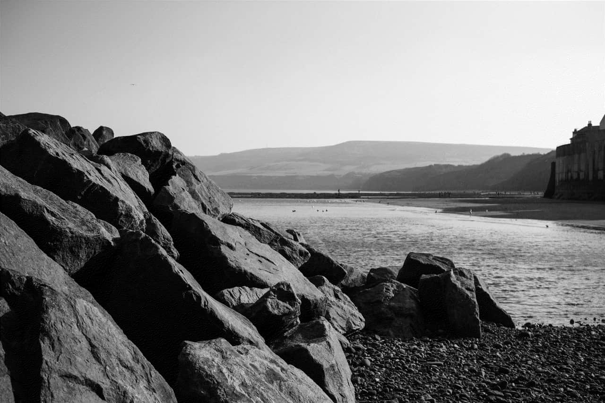

# Monochrome Dither

The filter converts the image to black and white monochrome.

## About the Monochrome Dither filter

This filter can be found in the **Filter** menu, in the **Colors** category.

This filter has no customizable settings.

#### SEE ALSO:

- [Applying filters](../01-applying-filters.md)
- [Web Safe Dither](16-filter-websafedither.md)
