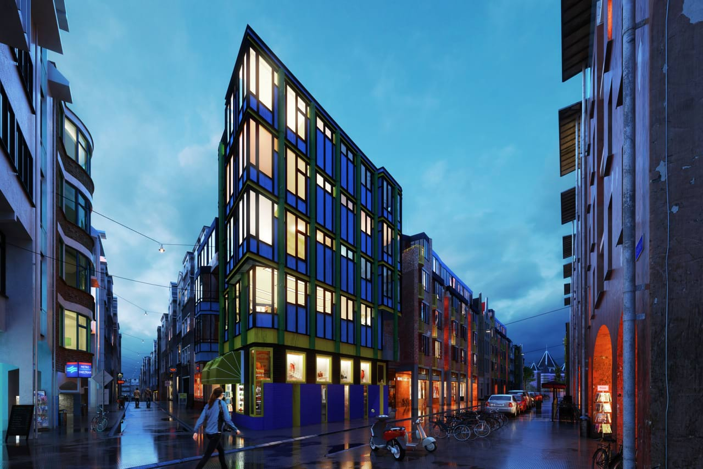
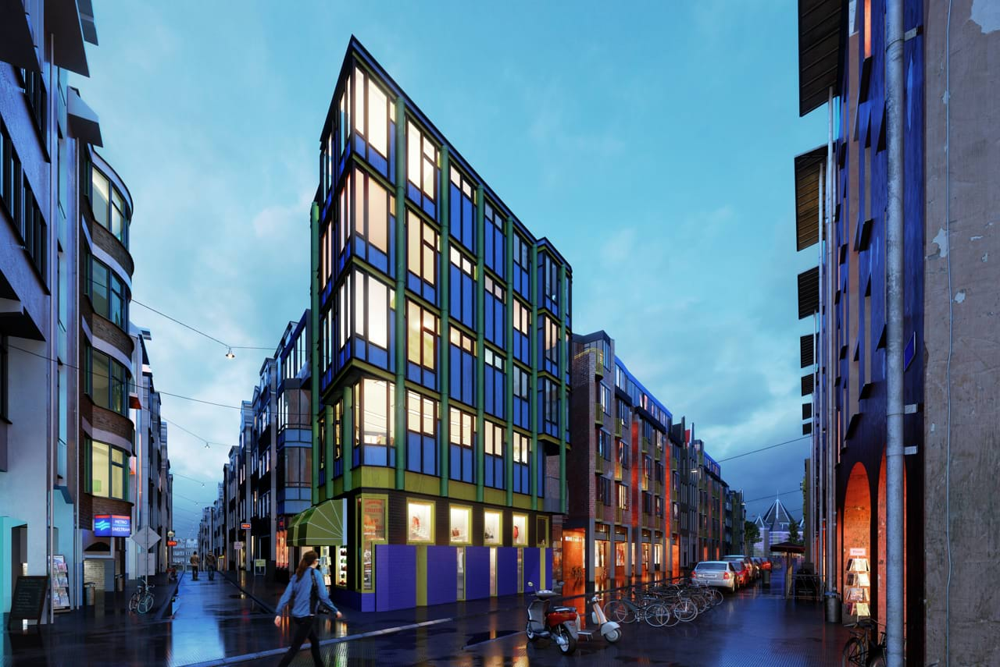
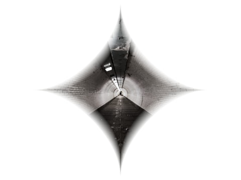

# Procedural Texture

The Procedural Texture filter allows you to perform a number of pixel manipulations using predetermined functions and user defined variables. It's possible to essentially write your own filters with configurable parameters.

*Before and after. A bump map is created from a normal map using **dot** and **debump** functions, then a **Soft Light** blend mode is used to "relight" a 3D render.*

## About the Procedural Texture filter

This filter can be applied as a [non-destructive, live filter](../../06-layers/08-using-live-filters.md). It can be accessed via the **Layer** menu, from the **New Live Filter Layer** category.

### Settings

The following settings can be adjusted in the filter dialog:

- **Equations**—you can define multiple equation lines. This is where you write the functions to manipulate the pixel content. You can also target specific channels by clicking the channel buttons to the right of the equation entry.
- **Custom Inputs**—add custom input variables here. You can use the following variable types:
  - **0-1 Range Input**—a standard input range. Configurable via a slider.
  - **-1-1 Range Input**—a harmonic input range (useful for harmonic functions). Configurable via a slider.
  - **Real Number Input**—actual number value with no limit.
  - **Integer Number Input**—numerical input limited to integer values.
  - **Angle Input**—angle input, used with vector expressions. Configurable by click-dragging.
  - **Elevation-Rotation Input**—direction-based vector input. Configurable by click-dragging.

---

## Using the filter

The filter has several key components that must be understood in order to use it effectively:

- **Equation lines**
  - The equation line entries are where you type the expressions and functions to achieve the desired result. Multiple line entries are typically used to target separate channels—if you are targeting all channels simultaneously then you would only need one entry.
- **Channel targets**
  - When you create a new expression line, just the channel red (**R**) is targeted by default, meaning only the red channel data is affected by the outcome of the expression. You can click on the **R**, **G**, **B** and **A** channel labels to add or remove them from the expression. Channel targeting is an important part of achieving the desired result from the expression.
  - To target all color data cumulatively, enable **R**, **G** and **B** but not **A**.
  - To target just the alpha channel data, disable **R**, **G** and **B** and enable **A**.
- **Variables**
  - Function results can be assigned to variables in order to streamline the overall expression and aid readability. The syntax follows the convention of **var varname=function();**
  - You can define as many variables as required—simply separate them with a semicolon (**;**).
  - e.g. `var v=vec2(rx, ry); var clr=vec3(R,G,B);`
  - The above creates two variables: one a vector from relative X and Y canvas positions (**v**), and the other a vector from the RGB color data (**clr**). The variables **v** and **clr** can then be used in a following function or set of functions.
- **Functions**
  - Functions bring everything together and are used to achieve the final result.
  - See the extensive table below for a full list of available functions: they range from mathematical calculations to vector creation, interpolators, oscillators and noise generators.
  - The syntax follows the typical convention of **function(input, parameter)** (multiple inputs and parameters where applicable).
  - e.g. **scurveinterp(T a, T b, T t)** could be used as `scurveinterp(R, B, 0.5)`. This would interpolate between red and blue channel data with a balance/mix of 50% (since the balance can be a value between **0** and **1**).
- **Parentheses**
  - Parentheses are used for groupings exactly as they would be in traditional mathematics.
  - For example, take this equation line: `R/(a*2)`
  - By putting **a*2** in parentheses, it will be evaluated first before being divided into **R**.
  - Here is a more complex example: `var v2=vec2(rx/w/2, ry/h/(b*2)); dir(v2*(a*2))*(c*2)` (the parentheses are highlighted in bold)
  - In this example, the variable **b** is multiplied by **2**, but this is evaluated first before becoming part of the final `ry/h/(b*2)` calculation. If this expression was not in parentheses, the outcome would be different.
- **Custom Inputs**
  - Custom inputs can improve the accessibility of the expressions and allow parameters to be altered quickly.
  - There are several input buttons depending on the type of custom input required (see the **Custom Inputs** list above).
  - Custom inputs are assigned to variables for use in the expressions. Simplified variable names are provided by default when you add a new custom input, e.g. **a**, **b**, **c**.
  - You can name these input variables whatever you wish so long as *they do not clash with established function names and persistent variables* (e.g. **w** for width, **R** for red channel, **vec2** for a vector creation function). If you have clashing variables, they will simply be unable to be referenced.
  - To use them, reference them in a function, e.g. `perlin(rx, ry, a, b)`—where **a** controls *octaves* and **b** controls *persistence*.

---

## Examples

Here are some practical examples of how the procedural texture filter can be used. Custom input variables are highlighted in **bold**. To follow along with them, copy & paste the code line into a new equation line, set channel targets if necessary, then create custom inputs following the table entries.

### Round Vignette

`var vignettew=vec2(rx, ry)/w; var vignetteh=vec2(rx, ry)/h; var productw=oscsc(vignettew); var producth=oscsc(vignetteh); scurveinterp(productw, producth, roundness)*(intensity*imultiplier)`

Target all three channels (**R**, **G** and **B**). Use a blend mode such as **Screen**.

| Custom Input Type | Variable Name | Explanation |
| --- | --- | --- |
| [0,1] range input | roundness | Used as a variable in **scurveinterp** to control the vignette roundness. |
| [0,1] range input | intensity | This value is multiplied by the **scurveinterp** result to modify the intensity (brightness) of the vignette. |
| Real number input | imultiplier | This real number is multiplied by the **intensity** value in order to scale it, resulting in a greater range of achievable brightness. |

In this expression, we have four variable declarations. **rx** and **ry** are used to create two vector results: **vignettew** and **vignetteh**. The vector results are divided by the width and height respectively. From these, we then calculate **productw** and **producth** by using S-curve oscillators (**oscsc**). Finally, we interpolate between these two product results using an S-curve interpolant (**scurveinterp**). The mix between the two results is controlled by the **roundness** custom input and the brightness is scaled by the **intensity** and **imultiplier** custom inputs.

Because **rx** and **ry** (relative X and Y positions) are used for the vector creation, the user can click-drag on the canvas to determine the center (origin) point of the vignette.

When the filter is used with an appropriate blend mode (using the [live filter](../../06-layers/08-using-live-filters.md) version is recommended), a suitable vignette effect can be achieved.

### Diamond Alpha Mask

`var v=vec2(rx,ry)/w; smoothoschlin(oschcr(v/(dsize*dmult)), dsmooth)`

Target **only the alpha channel (A)**.

| Custom Input Type | Variable Name | Explanation |
| --- | --- | --- |
| [0,1] range input | dsmooth | Controls the smoothing of the mask edges. |
| [0,1] range input | dsize | Determines the size of the mask. |
| Real number input | dmult | Scales **dsize** by a multiplier to allow for bigger/smaller mask sizes. |

Here, we assign the results of vector creation using **rx** and **ry** to the variable **v** (dividing the result by the document width, **w**). The **v** result is then put through a harmonic oscillator with a Catmull-Rom spline (**oschcr**), which itself is then put through a smooth harmonic linear oscillator (**smoothoschlin**). Within the **oschcr** function, **v** is divided by **dsize*dmult**, which controls the overall size. **dsmooth** is used within the **smoothoschlin** function to influence the smoothness and blurring of the edges. When the channel target is set to just alpha (**A**), this expression creates a diamond alpha mask effect.

Because **rx** and **ry** (relative X and Y positions) are used for the vector creation, the user can click-drag on the canvas to alter the position of the mask effect.

---

## Functions

Below is a table of functions that can be used in the Equations section, where:

- T means Type, which can be either a scalar or vector (but not an integer).
- V = vector (non-scalar, 2 to 6 components).
- S = scalar (non-vector).
- I = single integer (neither scalar nor fractional)—internally, the input could be fractional, but the value will be rounded/truncated to an integer.

Where a function takes T or V arguments, the vector size must be the same for all arguments. They are not interchangeable.

| Function | Usage | Notes |
| --- | --- | --- |
| Common mathematics |  |  |
| abs | abs(T) | Round value to absolute integer |
| acos | acos(T) |  |
| asin | asin(T) |  |
| atan | atan(T) |  |
| atan2 | atan2(T, T) |  |
| average | average(T, T, ...) (variable arguments) |  |
| ceil | ceil(T) | Round up value |
| copysign | copysign(T, T sign) |  |
| cos | cos(T) |  |
| dim | dim(T x, T y) |  |
| floor | floor(T) | Round down value |
| fma | fma(T a, T b, T c) | Computes (a*b) + c |
| fmod | fmod(T, T) |  |
| fraction | fraction(T) |  |
| idiv | idiv(T, T) |  |
| irem | irem(T, T) |  |
| lerp | lerp(T a, T b, T t) | Linear interpolate between two values, balanced determined by **t** between 0-1 |
| max | max(T, T, ...) (variable arguments) |  |
| mid | mid(T, T) |  |
| min | min(T, T, ...) (variable arguments) |  |
| mix | mix(T a, T b, T t) | Same as **lerp** |
| pow | pow(T x, T y) | **x** to the power of **y** |
| powr | powr(T x, T y) | **x** to the power of **y** where **x**>0 |
| round | round(T) |  |
| roundup | roundup(T) |  |
| rounddown | rounddown(T) |  |
| sign | sign(T) |  |
| sin | sin(T) |  |
| sq | sq(T) |  |
| sqrt | sqrt(T) | Square root |
| tan | tan(T) |  |
| trunc | trunc(T) | Shorthand for **truncate** |
| truncate | truncate(T) |  |
| rgbtoi | rgbtoi(S r, S g, Sb) or rgbtoi(V rgb) |  |
| whole | whole(T) |  |
| Numeric range conversion |  |  |
| tocui | tocui(T) | To closed unit interval between 0-1 |
| tohcui | tohcui(T) | To closed unit interval between -1-1 (harmonic) |
| Clamping |  |  |
| saturate | saturate(T) |  |
| clamp | clamp(T) or clamp(T, T min, T max) |  |
| clampmin | clampmin(T, T min) |  |
| clampmax | clampmax(T, T max) |  |
| Geometric functions |  |  |
| cross | cross(V3, V3) | Calculate cross product of two Vector3 (XYZ) components |
| dist | dist(V a, V b) | Shorthand for **distance** |
| dist_sq | dist_sq(V a, V b) | Shorthand for **distance_squared** |
| distance | distance(V a, V b) |  |
| distance_squared | distance_squared(V a, V b) |  |
| dot | dot(V, V) |  |
| length | length(V) or length(S, S, ...) |  |
| length_squared | length_squared(V) or length_squared(S, S, ...) |  |
| norm | norm(V) | Shorthand for **normalise** or **normalize** |
| normalise | normalise(V) |  |
| normalize | normalize(V) |  |
| Vector creation |  |  |
| vec2 | vec2(S) or vec2(S, S) | Good for creating vectors from XY positioning, e.g. `vec2(rx, ry)` |
| vec3 | vec3(S) or vec3(S, S, S) | Can be used to create vectors from color data, e.g. `vec3(R, G, B)` |
| vec4 | vec4(S) or vec4(S, S, S, S) |  |
| vec5 | vec5(S) or vec5(S, S, S, S, S) |  |
| vec6 | vec6(S) or vec6(S, S, S, S, S, S) |  |
| tovec3 | tovec3(V) |  |
| tovec4 | tovec4(V) |  |
| tovec5 | tovec5(V) |  |
| tovec6 | tovec6(V) |  |
| Vector manipulation |  |  |
| rev | rev(V) |  |
| rotl | rotl(V) | Rotate vector left |
| rotr | rotr(V) | Rotate vector right |
| swap12 | swap12(V) |  |
| swap13 | swap13(V) |  |
| swap23 | swap23(V) |  |
| swapxy | swapxy(V) |  |
| swapxz | swapxz(V) |  |
| swapyz | swapyz(V) |  |
| swaprg | swaprg(V) |  |
| swaprb | swaprb(V) |  |
| swapgb | swapgb(V) |  |
| neg1 | neg1(V) |  |
| neg2 | neg2(V) |  |
| neg3 | neg3(V) |  |
| neg12 | neg12(V) |  |
| negx | negx(V) |  |
| negy | negy(V) |  |
| negz | negz(V) |  |
| negxy | negxy(V) |  |
| negr | negr(V) |  |
| negg | negg(V) |  |
| negb | negb(V) |  |
| negrg | negrg(V) |  |
| Vector utilities |  |  |
| debump | debump(S r, S g, S b) |  |
| Interpolation |  |  |
| scurveinterp | scurveinterp(T a, T b, T t) |  |
| sininterp | sininterp(T a, T b, T t) |  |
| cubicinterp | cubicinterp(T a, T b, T c, T d, T t) |  |
| scurveinterpolant | scurveinterpolant(T cui) |  |
| sininterpolant | sininterpolant(T cui) |  |
| scerp | scerp(T a, T b, T t) | Shorthand for **scurveinterp** |
| serp | serp(T a, T b, T t) | Shorthand for **sininterp** |
| cerp | cerp(T a, T b, T c, T d, T t) | Shorthand for **cubicinterp** |
| cubic | scerp(T a, T b, T c, T d, T t) | Shorthand for **cubicinterp** |
| scint | scint(T cui) | Shorthand for **scurverinterpolant** |
| sint | sint(T cui) | Shorthand for **sininterpolant** |
| Stepping |  |  |
| mapcui | mapcui(T v, T edge0, T edge1) |  |
| step | step(T edge, T v) |  |
| stepn | stepn(T edge, T v) |  |
| smoothsteplin | smoothsteplin(T edge0, T edge1, T v) or smoothsteplin(T in0, T in1, T out1, T out0, T v) |  |
| smoothstep | smoothstep(T edge0, T edge1, T v) or smoothstep(T in0, T in1, T out1, T out0, T v) |  |
| smoothstepsc | smoothstepsc(T edge0, T edge1, T v) or smoothstepsc(T in0, T in1, T out1, T out0, T v) |  |
| smoothstepsin | smoothstepsin(T edge0, T edge1, T v) or smoothstepsin(T in0, T in1, T out1, T out0, T v) |  |
| smoothstepcs | smoothstepcs(T edge0, T edge1, T v) or smoothstepcs(T in0, T in1, T out1, T out0, T v) |  |
| smoothstepsq | smoothstepsq(T edge0, T edge1, T v) or smoothstepsq(T in0, T in1, T out1, T out0, T v) |  |
| smoothstepsqi | smoothstepsqi(T edge0, T edge1, T v) or smoothstepsqi(T in0, T in1, T out1, T out0, T v) |  |
| smoothstepcb | smoothstepcb(T edge0, T edge1, T v) or smoothstepcb(T in0, T in1, T out1, T out0, T v) |  |
| smoothstepcbi | smoothstepcbi(T edge0, T edge1, T v) or smoothstepcbi(T in0, T in1, T out1, T out0, T v) |  |
| smoothstepsin | smoothstepsin(T edge0, T edge1, T v) or smoothstepsin(T in0, T in1, T out1, T out0, T v) |  |
| smoothstepsini | smoothstepsini(T edge0, T edge1, T v) or smoothstepsini(T in0, T in1, T out1, T out0, T v) |  |
| smoothstepcr | smoothstepcr(T edge0, T edge1, T v) or smoothstepcr(T in0, T in1, T out1, T out0, T v) |  |
| smoothstepcri | smoothstepcri(T edge0, T edge1, T v) or smoothstepcri(T in0, T in1, T out1, T out0, T v) |  |
| smoothsteprt | smoothsteprt(T edge0, T edge1, T v) or smoothsteprt(T in0, T in1, T out1, T out0, T v) |  |
| smoothsteprti | smoothsteprti(T edge0, T edge1, T v) or smoothsteprti(T in0, T in1, T out1, T out0, T v) |  |
| smoothstepnlin | smoothstepnlin(T edge1, T edge0, T v) |  |
| smoothstepn | smoothstepn(T edge1, T edge0, T v) |  |
| smoothstepnsc | smoothstepnsc(T edge1, T edge0, T v) |  |
| smoothstepnsin | smoothstepnsin(T edge1, T edge0, T v) |  |
| smoothstepncs | smoothstepncs(T edge1, T edge0, T v) |  |
| smoothstepnsq | smoothstepnsq(T edge1, T edge0, T v) |  |
| smoothstepnsqi | smoothstepnsqi(T edge1, T edge0, T v) |  |
| smoothstepncb | smoothstepncb(T edge1, T edge0, T v) |  |
| smoothstepncbi | smoothstepncbi(T edge1, T edge0, T v) |  |
| smoothstepnpsini | smoothstepnpsini(T edge1, T edge0, T v) |  |
| smoothstepncr | smoothstepncr(T edge1, T edge0, T v) |  |
| smoothstepncri | smoothstepncri(T edge1, T edge0, T v) |  |
| smoothstepnrt | smoothstepnrt(T edge1, T edge0, T v) |  |
| smoothstepnrti | smoothstepnrti(T edge1, T edge0, T v) |  |
| Quantisation |  |  |
| quantize | quantize(T band, T v) or quantize(T band, T smooth, T v) |  |
| quantizelin | quantizelin(T band, T smooth, T v) |  |
| quantizesc | quantizesc(T band, T smooth, T v) |  |
| quantizesin | quantizesin(T band, T smooth, T v) |  |
| quantizecs | quantizecs(T band, T smooth, T v) |  |
| Oscillators |  |  |
| osci | osci(S)   osci(S, S)   osci(V2) | Standard oscillation, accepts scalar or vector inputs |
| oscsc | oscsc(S)   oscsc(S, S)   oscsc(V2) | Oscillator with S-Curve |
| oscsin | oscsin(S)   oscsin(S, S)   oscsin(V2) |  |
| osccs | osccs(S)   osccs(S, S)   osccs(V2) |  |
| osccubic | osccubic(S)   osccubic(S, S)   osccubic(V2) |  |
| oscsq | oscsq(S)   oscsq(S, S)   oscsq(V2) |  |
| oscsqi | oscsqi(S)   oscsqi(S, S)   oscsqi(V2) |  |
| osccb | osccb(S)   osccb(S, S)   osccb(V2) |  |
| osccbi | osccbi(S)   osccbi(S, S)   osccbi(V2) |  |
| oscpsin | oscpsin(S)   oscpsin(S, S)   oscpsin(V2) |  |
| oscpsini | oscpsini(S)   oscpsini(S, S)   oscpsini(V2) |  |
| osccr | osccr(S)   osccr(S, S)   osccr(V2) |  |
| osccri | osccri(S)   osccri(S, S)   osccri(V2) |  |
| oscrt | oscrt(S)   oscrt(S, S)   oscrt(V2) |  |
| oscrti | oscrti(S)   oscrti(S, S)   oscrti(V2) |  |
| smoothosclin | smoothosclin(S, S smoothingwidth)   smoothosclin(S, S, S smoothingwidth)   smoothosclin(V2, S smoothingwidth) |  |
| smoothosc | smoothosc(S, S smoothingwidth)   smoothosc(S, S, S smoothingwidth)   smoothosc(V2, S smoothingwidth) |  |
| smoothoscsc | smoothoscsc(S, S smoothingwidth)   smoothoscsc(S, S, S smoothingwidth)   smoothoscsc(V2, S smoothingwidth) |  |
| smoothoscsin | smoothoscsin(S, S smoothingwidth)   smoothoscsin(S, S, S smoothingwidth)   smoothoscsin(V2, S smoothingwidth) |  |
| smoothosccs | smoothosccs(S, S smoothingwidth)   smoothosccs(S, S, S smoothingwidth)   smoothosccs(V2, S smoothingwidth) |  |
| Harmonic Oscillators |  |  |
| oschi | oschi(S)   oschi(S, S)   oschi(V2) |  |
| osch | osch(S)   osch(S, S)   osch(V2) |  |
| oschsc | oschsc(S)   oschsc(S, S)   oschsc(V2) |  |
| oschsin | oschsin(S)   oschsin(S, S)   oschsin(V2) |  |
| oschcs | oschcs(S)   oschcs(S, S)   oschcs(V2) |  |
| oschcubic | oschcubic(S)   oschcubic(S, S)   oschcubic(V2) |  |
| oschsq | oschsq(S)   oschsq(S, S)   oschsq(V2) |  |
| oschsqi | oschsqi(S)   oschsqi(S, S)   oschsqi(V2) |  |
| oschcb | oschcb(S)   oschcb(S, S)   oschcb(V2) |  |
| oschcbi | oschcbi(S)   oschcbi(S, S)   oschcbi(V2) |  |
| oschhsin | oschhsin(S)   oschhsin(S, S)   oschhsin(V2) |  |
| oschhsini | oschhsini(S)   oschhsini(S, S)   oschhsini(V2) |  |
| oschcr | oschcr(S)   oschcr(S, S)   oschcr(V2) |  |
| oschcri | oschcri(S)   oschcri(S, S)   oschcri(V2) |  |
| oschrt | oschrt(S)   oschrt(S, S)   oschrt(V2) |  |
| oschrti | oschrti(S)   oschrti(S, S)   oschrti(V2) |  |
| smoothoschlin | smoothoschlin(S, S smoothingwidth)   smoothoschlin(S, S, S smoothingwidth)   smoothoschlin(V2, S smoothingwidth) |  |
| smoothosch | smoothosch(S, S smoothingwidth)   smoothosch(S, S, S smoothingwidth)   smoothosch(V2, S smoothingwidth) |  |
| smoothoschsc | smoothoschsc(S, S smoothingwidth)   smoothoschsc(S, S, S smoothingwidth)   smoothoschsc(V2, S smoothingwidth) |  |
| smoothoschsin | smoothoschsin(S, S smoothingwidth)   smoothoschsin(S, S, S smoothingwidth)   smoothoschsin(V2, S smoothingwidth) |  |
| smoothoschcs | smoothoschcs(S, S smoothingwidth)   smoothoschcs(S, S, S smoothingwidth)   smoothoschcs(V2, S smoothingwidth) |  |
| Simple noise |  |  |
| noisei | noisei(S)   noisei(S, S)   noisei(S, S, S)   noisei(V2)   noisei(V3) |  |
| noise | noise(S)   noise(S, S)   noise(S, S, S)   noise(V2)   noise(V3) | Linear noise |
| noisesc | noisesc(S)   noisesc(S, S)   noisesc(S, S, S)   noisesc(V2)   noisesc(V3) | S-Curve noise |
| noisesin | noisesin(S)   noisesin(S, S)   noisesin(S, S, S)   noisesin(V2)   noisesin(V3) |  |
| noisecs | noisecs(S)   noisecs(S, S)   noisecs(S, S, S)   noisecs(V2)   noisecs(V3) |  |
| noisecubic | noisecubic(S)   noisecubic(S, S)   noisecubic(S, S, S)   noisecubic(V2)   noisecubic(V3) |  |
| noisesq | noisesq(S)   noisesq(S, S)   noisesq(S, S, S)   noisesq(V2)   noisesq(V3) |  |
| noisesqi | noisesqi(S)   noisesqi(S, S)   noisesqi(S, S, S)   noisesqi(V2)   noisesqi(V3) |  |
| noisecb | noisecb(S)   noisecb(S, S)   noisecb(S, S, S)   noisecb(V2)   noisecb(V3) |  |
| noisecbi | noisecbi(S)   noisecbi(S, S)   noisecbi(S, S, S)   noisecbi(V2)   noisecbi(V3) |  |
| noisepsin | noisepsin(S)   noisepsin(S, S)   noisepsin(S, S, S)   noisepsin(V2)   noisepsin(V3) |  |
| noisepsini | noisepsini(S)   noisepsini(S, S)   noisepsini(S, S, S)   noisepsini(V2)   noisepsini(V3) |  |
| noisecr | noisecr(S)   noisecr(S, S)   noisecr(S, S, S)   noisecr(V2)   noisecr(V3) |  |
| noisecri | noisecri(S)   noisecri(S, S)   noisecri(S, S, S)   noisecri(V2)   noisecri(V3) |  |
| noisert | noisert(S)   noisert(S, S)   noisert(S, S, S)   noisert(V2)   noisert(V3) |  |
| noiserti | noiserti(S)   noiserti(S, S)   noiserti(S, S, S)   noiserti(V2)   noiserti(V3) |  |
| Harmonic Simple noise |  |  |
| noisehi | noisehi(S)   noisehi(S, S)   noisehi(S, S, S)   noisehi(V2)   noisehi(V3) |  |
| noiseh | noiseh(S)   noiseh(S, S)   noiseh(S, S, S)   noiseh(V2)   noiseh(V3) |  |
| noisehsc | noisehsc(S)   noisehsc(S, S)   noisehsc(S, S, S)   noisehsc(V2)   noisehsc(V3) |  |
| noisehsin | noisehsin(S)   noisehsin(S, S)   noisehsin(S, S, S)   noisehsin(V2)   noisehsin(V3) |  |
| noisehcs | noisehcs(S)   noisehcs(S, S)   noisehcs(S, S, S)   noisehcs(V2)   noisehcs(V3) |  |
| noisehcubic | noisehcubic(S)   noisehcubic(S, S)   noisehcubic(S, S, S)   noisehcubic(V2)   noisehcubic(V3) |  |
| noisehsq | noisehsq(S)   noisehsq(S, S)   noisehsq(S, S, S)   noisehsq(V2)   noisehsq(V3) |  |
| noisehsqi | noisehsqi(S)   noisehsqi(S, S)   noisehsqi(S, S, S)   noisehsqi(V2)   noisehsqi(V3) |  |
| noisehcb | noisehcb(S)   noisehcb(S, S)   noisehcb(S, S, S)   noisehcb(V2)   noisehcb(V3) |  |
| noisehcbi | noisehcbi(S)   noisehcbi(S, S)   noisehcbi(S, S, S)   noisehcbi(V2)   noisehcbi(V3) |  |
| noisehpsin | noisehpsin(S)   noisehpsin(S, S)   noisehpsin(S, S, S)   noisehpsin(V2)   noisehpsin(V3) |  |
| noisehpsini | noisehpsini(S)   noisehpsini(S, S)   noisehpsini(S, S, S)   noisehpsini(V2)   noisehpsini(V3) |  |
| noisehcr | noisehcr(S)   noisehcr(S, S)   noisehcr(S, S, S)   noisehcr(V2)   noisehcr(V3) |  |
| noisehcri | noisehcri(S)   noisehcri(S, S)   noisehcri(S, S, S)   noisehcri(V2)   noisehcri(V3) |  |
| noisehrt | noisehrt(S)   noisehrt(S, S)   noisehrt(S, S, S)   noisehrt(V2)   noisehrt(V3) |  |
| noisehrti | noisehrti(S)   noisehrti(S, S)   noisehrti(S, S, S)   noisehrti(V2)   noisehrti(V3) |  |
| Perlin Noise |  |  |
| perlin | perlin(S x, I octaves, S persistence)   perlin(S x, S y, I octaves, S persistence)   perlin(V2 pt, I octaves, S persistence) |  |
| perlinsc | perlinsc(S x, I octaves, S persistence)   perlinsc(S x, S y, I octaves, S persistence)   perlinsc(V2 pt, I octaves, S persistence) |  |
| perlinsin | perlinsin(S x, I octaves, S persistence)   perlinsin(S x, S y, I octaves, S persistence)   perlinsin(V2 pt, I octaves, S persistence) |  |
| perlincubic | perlincubic(S x, I octaves, S persistence)   perlincubic(S x, S y, I octaves, S persistence)   perlincubic(V2 pt, I octaves, S persistence) |  |
| perlincs | perlincs(S x, I octaves, S persistence)   perlincs(S x, S y, I octaves, S persistence)   perlincs(V2 pt, I octaves, S persistence) |  |
| Harmonic Perlin Noise |  |  |
| perlinh | perlinh(S x, I octaves, S persistence)   perlinh(S x, S y, I octaves, S persistence)   perlinh(V2 pt, I octaves, S persistence) |  |
| perlinhsc | perlinhsc(S x, I octaves, S persistence)   perlinhsc(S x, S y, I octaves, S persistence)   perlinhsc(V2 pt, I octaves, S persistence) |  |
| perlinhsin | perlinhsin(S x, I octaves, S persistence)   perlinhsin(S x, S y, I octaves, S persistence)   perlinhsin(V2 pt, I octaves, S persistence) |  |
| perlinhcubic | perlinhcubic(S x, I octaves, S persistence)   perlinhcubic(S x, S y, I octaves, S persistence)   perlinhcubic(V2 pt, I octaves, S persistence) |  |
| perlinhcs | perlinhcs(S x, I octaves, S persistence)   perlinhcs(S x, S y, I octaves, S persistence)   perlinhcs(V2 pt, I octaves, S persistence) |  |
| Voronoi Noise |  |  |
| cellnoise | cellnoise(S x, S y)   cellnoise(S x, S y, S spread) |  |
| cellnoise2 | cellnoise2(S x, S y, I degree) |  |
| cellnoisedist | cellnoisedist(S x, S y)   cellnoisedist(S x, S y, S spread) |  |
| cellnoiseedge | cellnoiseedge(S x, S y, S sz, S softness) |  |
| Directional Noise |  |  |
| diri | diri(S)   diri(S, S)   diri(V2) |  |
| dir | dir(S)   dir(S, S)   dir(V2) |  |
| dirsc | dirsc(S)   dirsc(S, S)   dirsc(V2) |  |
| dirsin | dirsin(S)   dirsin(S, S)   dirsin(V2) |  |
| dircs | dircs(S)   dircs(S, S)   dircs(V2) |  |
| udiri | udiri(S)   udiri(S, S)   udiri(V2) |  |
| udir | udir(S)   udir(S, S)   udir(V2) |  |
| udirsc | udirsc(S)   udirsc(S, S)   udirsc(V2) |  |
| udirsin | udirsin(S)   udirsin(S, S)   udirsin(V2) |  |
| udircs | udircs(S)   udircs(S, S)   udircs(V2) |  |
| dir3i | dir3i(S)   dir3i(S, S)   dir3i(V2) |  |
| dir3 | dir3(S)   dir3(S, S)   dir3(V2) |  |
| dir3sc | dir3sc(S)   dir3sc(S, S)   dir3sc(V2) |  |
| dir3sin | dir3sin(S)   dir3sin(S, S)   dir3sin(V2) |  |
| dir3cs | dir3cs(S)   dir3cs(S, S)   dir3cs(V2) |  |
| udir3i | udir3i(S)   udir3i(S, S)   udir3i(V2) |  |
| udir3 | udir3(S)   udir3(S, S)   udir3(V2) |  |
| udir3sc | udir3sc(S)   udir3sc(S, S)   udir3sc(V2) |  |
| udir3sin | udir3sin(S)   udir3sin(S, S)   udir3sin(V2) |  |
| udir3cs | udir3cs(S)   udir3cs(S, S)   udir3cs(V2) |  |

#### SEE ALSO:

- [Applying filters](../01-applying-filters.md)
- [Equations filter](../04-distortion-filters/04-filter-equations.md)
- [Custom Blur](../02-blur-filters/06-filter-customblur.md)
- [Expressions for field input](../../38-expressions-for-field-input/01-expressions-for-field-input.md)
