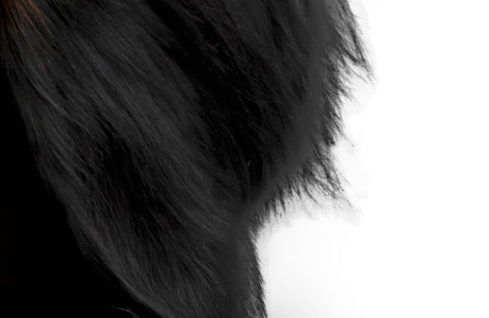
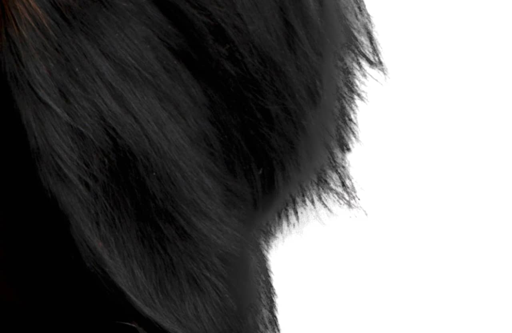

# Remove Black Matte

The Remove Black Matte filter identifies semi-transparent pixels around a subject that has been cut out and placed on a new background. The subject may have noticeable traces of black or gray where its edge meets its new background.

*Remove Black Matte applied to produce a more refined cut-out of an animal's fur.*

## About the Remove Black Matte filter

This filter can be found in the **Filters** menu, in the **Colors** category.

This filter has no customizable settings.

#### SEE ALSO:

- [Applying filters](../01-applying-filters.md)
- [Remove White Matte](11-filter-removewhitematte.md)
