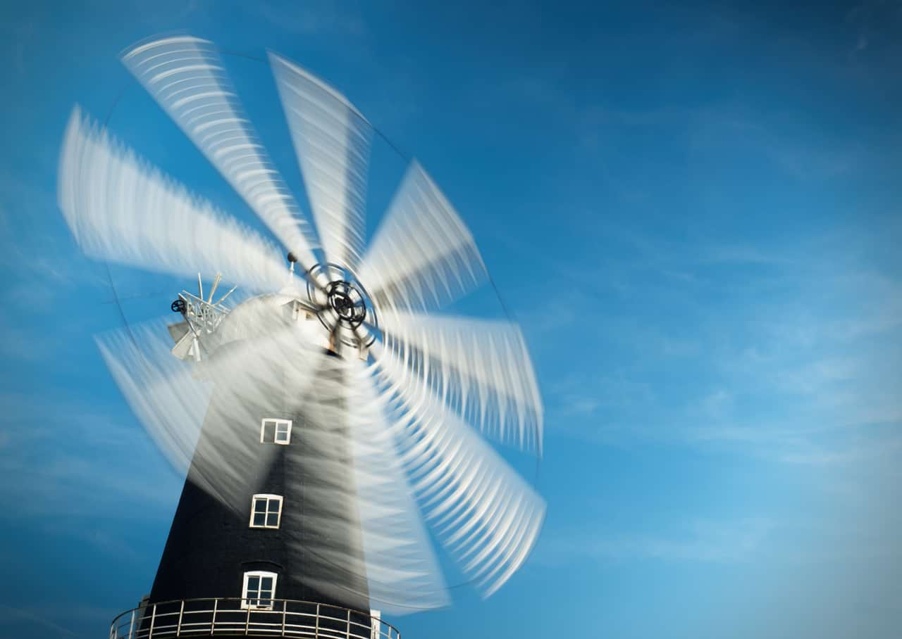

# Remove Vignette

The Remove Vignette filter automatically removes unwanted vignetting from the edges of your image. The filter makes a best effort attempt at removal. For heavily vignetted images (showing extreme instances or if a vignette has been applied by design), results may vary.

## About the Remove Vignette filter

This filter can be found in the **Filter** menu, in the **Colors** category.

This filter has no customizable settings.

#### SEE ALSO:

- [Vignette](14-filter-vignette.md)
