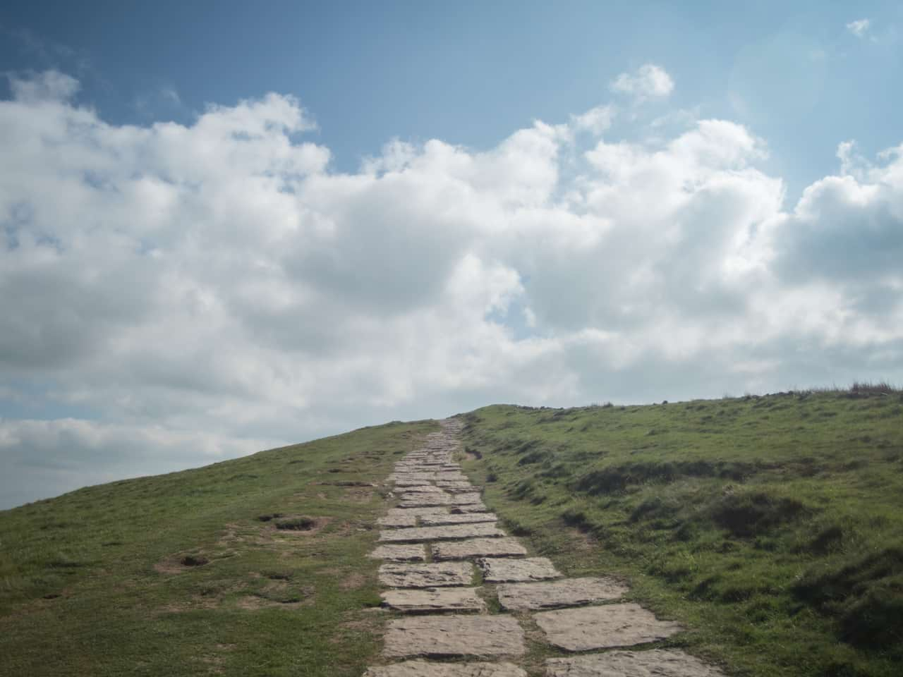
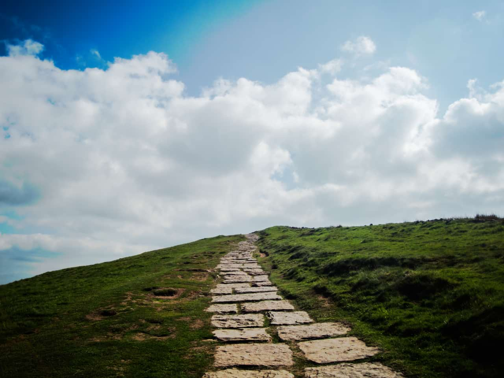

# Solarize

The Solarize filter lets you set a lightness value above which image colors are inverted.

*Solarize used with a blend mode of Subtract to create a stark contrast between shadows and highlights.*

## About the Solarize filter

This filter is used to imitate the darkroom technique of re-exposing a partially developed image to light to produce dramatic changes in mid-tone regions in the image.

This filter can be found in the **Filter** menu, in the **Colors** category.

This filter has no customizable settings.

#### SEE ALSO:

- [Applying filters](../01-applying-filters.md)
