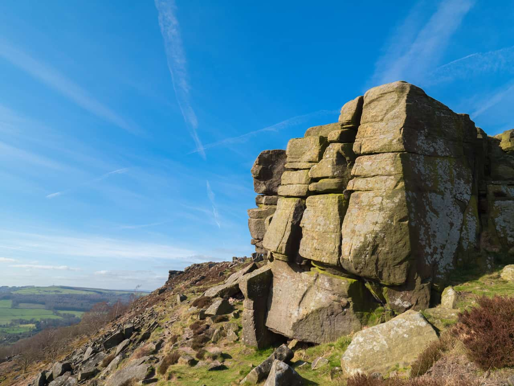
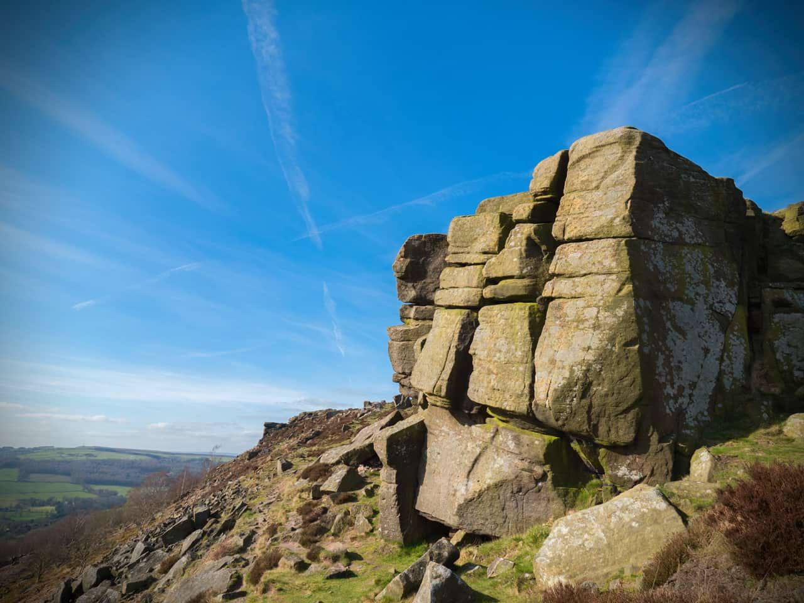

# Vignette

The Vignette filter can be used to either add vignetting to an image, or remove it from the image.

## About the Vignette filter

This filter can be applied as a [non-destructive, live filter](../../06-layers/08-using-live-filters.md). It can be accessed via the **Layer** menu, from the **New Live Filter Layer** category.

### Settings

The following settings can be adjusted in the filter dialog:

- **Exposure**—sets the type and value of the effect. Negative values darken the effect, positive values lighten the effect. Type directly in the text box or drag the slider to set the value.
- **Hardness**—controls how much feather/blur is applied to the transition. Type directly in the text box or drag the slider to set the value.
- **Scale**—controls the size of the vignette. Type directly in the text box or drag the slider to set the value.
- **Shape**—determines whether the vignette is circular or elliptical.

#### SEE ALSO:

- [Using live filters](../../06-layers/08-using-live-filters.md)
- [Applying filters](../01-applying-filters.md)
