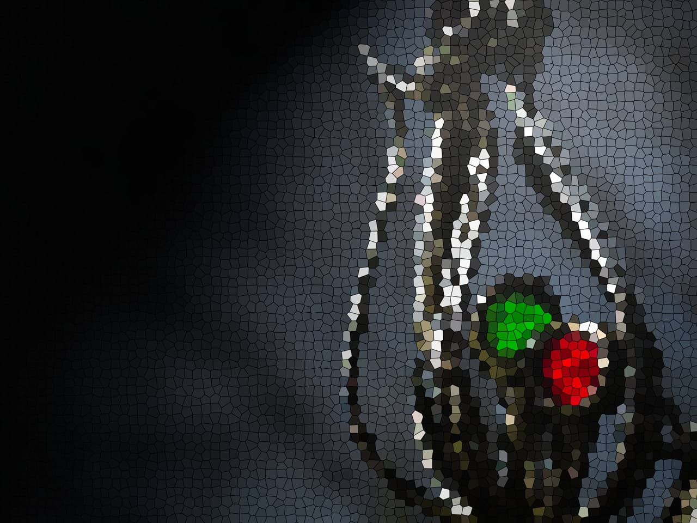

# Voronoi

The Voronoi filter creates a Voronoi diagram (also known as a Dirichlet tessellation) from a pixel layer.

### Settings

The following settings can be adjusted in the filter dialog:

- **Cell Size**—controls how the plane is partitioned into regions (Voronoi cells). A larger value results in larger regions.
- **Line Width**—alters the thickness of the black lines separating the regions.

#### SEE ALSO:

- [Halftone Filter](06-filter-halftone.md)
- [Applying filters](../01-applying-filters.md)
